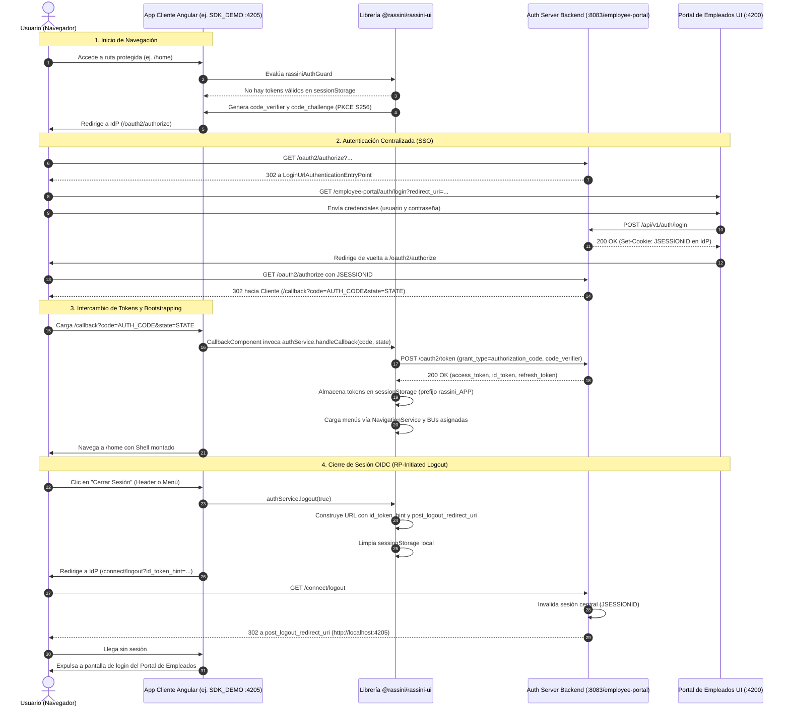

# Guía Técnica de Integración: SSO Corporativo, OAuth2/PKCE y @rassini/rassini-ui

Este documento técnico contiene las especificaciones, diagramas de arquitectura, prerrequisitos, configuraciones de base de datos, código fuente y flujos reales para integrar cualquier aplicación Angular al ecosistema de Single Sign-On (SSO) corporativo de Rassini mediante **Spring Authorization Server 1.4.x**, el protocolo **OAuth2 Authorization Code con PKCE (RFC 7636)**, **OpenID Connect 1.0** y la librería corporativa **`@rassini/rassini-ui`**.

---

## 1. Arquitectura General

El ecosistema de identidad y acceso corporativo está compuesto por cuatro componentes desacoplados:



### Componentes del Sistema

1. **Employee Portal Backend (`http://localhost:8083/employee-portal`)**:
   - Actúa simultáneamente como **Servidor de Autorización (Authorization Server)** bajo Spring Authorization Server 1.4.x y como **API de Recursos REST**.
   - Emite tokens JWT firmados asimétricamente (RS256) con claims corporativos: roles, permisos, unidades de negocio (`businessUnits`, `bu`), identificador de empleado y metadatos de sesión.
   - Implementa los endpoints estándar OIDC: `/.well-known/openid-configuration`, `/oauth2/authorize`, `/oauth2/token`, `/oauth2/jwks` y `/connect/logout`.

2. **Employee Portal Frontend (`http://localhost:4200/employee-portal`)**:
   - Aplicación Angular de referencia que aloja la interfaz de inicio de sesión institucional (`/employee-portal/auth/login`).
   - Sirve como la pantalla visual a la que el Servidor de Autorización delega el desafío de credenciales de usuario.

3. **Librería Corporativa `@rassini/rassini-ui`**:
   - Módulo desacoplado empaquetado para distribución en aplicaciones Angular corporativas.
   - Contiene los servicios de autenticación (`AuthenticationService`), arranque de sesión (`SessionBootstrapService`), navegación (`NavigationService`), contexto corporativo (`ContextService`), adaptadores de almacenamiento (`TokenStorageAdapter`), guards de rutas (`rassiniAuthGuard`, `rassiniRoleGuard`, `rassiniPermissionGuard`), interceptores HTTP (`rassiniTokenInterceptor`) y componentes visuales (`RassiniShell`, `RassiniTopbar`, `RassiniSidebar`).

4. **Aplicación Cliente Angular (ejemplo `SDK_DEMO` en `http://localhost:4205`)**:
   - Aplicación Single Page Application (SPA) pública que no almacena secretos de cliente.
   - Consume los servicios y el cascarón de `@rassini/rassini-ui` para autenticar al usuario sin manejar formularios de login propios.

---

## 2. Prerrequisitos y Registro del Cliente OAuth2

Antes de configurar la aplicación Angular, el cliente debe estar registrado en el esquema `iam` del Servidor de Autorización.

### Parámetros Requeridos

| Parámetro | Valor de Referencia | Descripción |
|---|---|---|
| **Client ID** | `sdk-demo-client` | Identificador público único de la aplicación cliente en el IdP. |
| **Client Authentication Method** | `none` | Cliente público (SPA en navegador; no usa `client_secret`). |
| **Authorization Grant Types** | `authorization_code`, `refresh_token` | Tipos de concesión autorizados. |
| **Authentication Flow** | PKCE obligatorio (`S256`) | Proof Key for Code Exchange para evitar intercepción de códigos. |
| **Redirect URI** | `http://localhost:4205/callback` | Ruta de retorno en el cliente a la que el IdP entrega el código. |
| **Post Logout Redirect URI** | `http://localhost:4205` | Ruta de retorno a la que el IdP redirige tras el cierre central de sesión. |
| **Issuer URL** | `http://localhost:8083/employee-portal` | URL base del servidor emisor de tokens. |
| **Scopes Requeridos** | `openid profile email roles permissions business_units offline_access` | Permisos solicitados para poblar claims en los tokens. |

### Script SQL de Registro (MySQL 8.x en esquema `iam`)

```sql
USE iam;

-- Registro del cliente público SPA con PKCE activado y scopes corporativos
INSERT INTO oauth2_registered_client (
    id,
    client_id,
    client_id_issued_at,
    client_secret,
    client_secret_expires_at,
    client_name,
    client_authentication_methods,
    authorization_grant_types,
    redirect_uris,
    post_logout_redirect_uris,
    scopes,
    client_settings,
    token_settings
) VALUES (
    'sdk-demo-client-id',
    'sdk-demo-client',
    NOW(),
    NULL, -- Cliente público: sin secreto
    NULL,
    'SDK Demo Client SPA',
    'none',
    'authorization_code,refresh_token',
    'http://localhost:4205/callback',
    'http://localhost:4205',
    'openid,profile,email,roles,permissions,business_units,offline_access',
    -- client_settings: requireProofKey=true (PKCE obligatorio)
    '{"@class":"java.util.Collections$UnmodifiableMap","settings.client.require-proof-key":true,"settings.client.require-authorization-consent":false}',
    -- token_settings: access_token TTL de 30 min, refresh_token TTL de 24 horas
    '{"@class":"java.util.Collections$UnmodifiableMap","settings.token.access-token-time-to-live":["java.time.Duration",1800.000000000],"settings.token.reuse-refresh-tokens":true,"settings.token.refresh-token-time-to-live":["java.time.Duration",86400.000000000],"settings.token.id-token-signature-algorithm":["org.springframework.security.oauth2.jose.jws.SignatureAlgorithm","RS256"]}'
) ON DUPLICATE KEY UPDATE 
    redirect_uris = VALUES(redirect_uris),
    post_logout_redirect_uris = VALUES(post_logout_redirect_uris),
    scopes = VALUES(scopes);
```

---

## 3. Configuración del Authorization Server (Spring Boot / OIDC)

El servidor de autorización se implementa en [`AuthorizationServerConfig.java`](file:///C:/workspace/employee-portal/src/main/java/com/rassini/employeeportal/oauth2/config/AuthorizationServerConfig.java) utilizando Spring Authorization Server 1.4.x.

### Endpoints Estándar y URLs Reales

| Endpoint OIDC | URL Real de Implementación | Método HTTP | Función |
|---|---|---|---|
| **Issuer** | `http://localhost:8083/employee-portal` | N/A | Identificador canónico del servidor emisor. |
| **OpenID Discovery** | `http://localhost:8083/employee-portal/.well-known/openid-configuration` | `GET` | Metadatos públicos del servidor OIDC. |
| **Authorize** | `http://localhost:8083/employee-portal/oauth2/authorize` | `GET` | Inicia el flujo Authorization Code con PKCE. |
| **Token** | `http://localhost:8083/employee-portal/oauth2/token` | `POST` | Emite tokens de acceso, id_token y refresh_token. |
| **JWKS (Claves)** | `http://localhost:8083/employee-portal/oauth2/jwks` | `GET` | Claves públicas RSA para validar firmas JWT. |
| **UserInfo** | `http://localhost:8083/employee-portal/userinfo` | `GET` / `POST` | Devuelve información del perfil del usuario autenticado. |
| **End Session (Logout)** | `http://localhost:8083/employee-portal/connect/logout` | `GET` / `POST` | Cierre de sesión central (RP-Initiated Logout). |

### Ejemplo Real del Documento de Descubrimiento (`/.well-known/openid-configuration`)

```json
{
  "issuer": "http://localhost:8083/employee-portal",
  "authorization_endpoint": "http://localhost:8083/employee-portal/oauth2/authorize",
  "token_endpoint": "http://localhost:8083/employee-portal/oauth2/token",
  "token_endpoint_auth_methods_supported": ["client_secret_basic", "client_secret_post", "none"],
  "jwks_uri": "http://localhost:8083/employee-portal/oauth2/jwks",
  "userinfo_endpoint": "http://localhost:8083/employee-portal/userinfo",
  "end_session_endpoint": "http://localhost:8083/employee-portal/connect/logout",
  "response_types_supported": ["code"],
  "grant_types_supported": ["authorization_code", "refresh_token", "client_credentials"],
  "code_challenge_methods_supported": ["S256"],
  "id_token_signing_alg_values_supported": ["RS256"],
  "scopes_supported": ["openid", "profile", "email", "roles", "permissions", "business_units", "offline_access"]
}
```

### Configuración en Java (`AuthorizationServerConfig.java`)

```java
package com.rassini.employeeportal.oauth2.config;

import org.springframework.beans.factory.annotation.Value;
import org.springframework.context.annotation.Bean;
import org.springframework.context.annotation.Configuration;
import org.springframework.core.Ordered;
import org.springframework.core.annotation.Order;
import org.springframework.http.MediaType;
import org.springframework.security.config.Customizer;
import org.springframework.security.config.annotation.web.builders.HttpSecurity;
import org.springframework.security.oauth2.server.authorization.config.annotation.web.configurers.OAuth2AuthorizationServerConfigurer;
import org.springframework.security.oauth2.server.authorization.settings.AuthorizationServerSettings;
import org.springframework.security.web.SecurityFilterChain;
import org.springframework.security.web.authentication.LoginUrlAuthenticationEntryPoint;
import org.springframework.security.web.util.matcher.MediaTypeRequestMatcher;

@Configuration
public class AuthorizationServerConfig {

    // Parametrización conceptual: inyectada desde application.yml según el ambiente (dev, qa, prod)
    // No hardcodear 'localhost:4200'; en producción se resuelve mediante variables de entorno
    @Value("${app.portal.login-url:http://localhost:4200/employee-portal/auth/login}")
    private String portalLoginUrl;

    @Bean
    @Order(Ordered.HIGHEST_PRECEDENCE)
    public SecurityFilterChain authorizationServerSecurityFilterChain(HttpSecurity http) throws Exception {
        OAuth2AuthorizationServerConfigurer authorizationServerConfigurer =
                OAuth2AuthorizationServerConfigurer.authorizationServer();

        http
            .securityMatcher(authorizationServerConfigurer.getEndpointsMatcher())
            .with(authorizationServerConfigurer, (authorizationServer) ->
                authorizationServer.oidc(Customizer.withDefaults()) // Habilita OIDC 1.0 (UserInfo y Connect Logout)
            )
            .authorizeHttpRequests((authorize) ->
                authorize.anyRequest().authenticated()
            )
            .exceptionHandling((exceptions) -> exceptions
                .defaultAuthenticationEntryPointFor(
                    // Punto de entrada dinámico hacia la interfaz visual de login corporativo
                    new LoginUrlAuthenticationEntryPoint(portalLoginUrl),
                    new MediaTypeRequestMatcher(MediaType.TEXT_HTML)
                )
            );

        return http.build();
    }

    @Bean
    public AuthorizationServerSettings authorizationServerSettings() {
        return AuthorizationServerSettings.builder()
                .issuer("http://localhost:8083/employee-portal")
                .build();
    }
}
```

```yaml
# application.yml: Definición conceptual por ambiente
app:
  portal:
    login-url: ${PORTAL_LOGIN_URL:http://localhost:4200/employee-portal/auth/login}
```

---

## 4. Configuración de `@rassini/rassini-ui`

### Modelo de Configuración: `CorporateOidcConfig`

En la librería `@rassini/rassini-ui`, la interfaz [`CorporateOidcConfig`](file:///C:/workspace/sakai-ng/projects/rassini-ui/src/lib/corporate/models/corporate.models.ts#L29-L38) define todos los parámetros necesarios para que el cliente Angular se comunique con el IdP:

```typescript
export interface CorporateOidcConfig {
  /** Código único de la aplicación registrado en el catálogo corporativo (ej. 'SDK_DEMO') */
  applicationCode: string;

  /** Identificador público registrado en el Authorization Server (ej. 'sdk-demo-client') */
  clientId: string;

  /** URL base del emisor OIDC sin barra final (ej. 'http://localhost:8083/employee-portal') */
  issuer: string;

  /** URI absoluta donde la SPA recibe el Authorization Code (ej. 'http://localhost:4205/callback') */
  redirectUri: string;

  /** URI absoluta a la que el IdP redirige tras el cierre de sesión central (ej. 'http://localhost:4205') */
  postLogoutRedirectUri?: string;

  /** Espacio de scopes requeridos separados por espacio */
  scope?: string;

  /** Lista de orígenes de backend autorizados para inyección de token Bearer en el interceptor */
  allowedApiOrigins: string[];
}
```

### Ejemplo Real de Configuración (`app.config.ts`)

```typescript
import { ApplicationConfig, provideZonelessChangeDetection } from '@angular/core';
import { provideRouter } from '@angular/router';
import { provideHttpClient } from '@angular/common/http';
import { 
  provideRassiniCorporate, 
  CorporateOidcConfig,
  provideRassiniTheme 
} from '@rassini/rassini-ui';
import { routes } from './app.routes';

export const SDK_DEMO_OIDC_CONFIG: CorporateOidcConfig = {
  applicationCode: 'SDK_DEMO',
  clientId: 'sdk-demo-client',
  issuer: 'http://localhost:8083/employee-portal',
  redirectUri: 'http://localhost:4205/callback',
  postLogoutRedirectUri: 'http://localhost:4205',
  scope: 'openid profile email roles permissions business_units offline_access',
  allowedApiOrigins: [
    'http://localhost:8083'
  ]
};

export const appConfig: ApplicationConfig = {
  providers: [
    provideZonelessChangeDetection(),
    provideRouter(routes),
    provideHttpClient(),
    provideRassiniTheme(),
    // Inicializa AuthenticationService, SessionBootstrapService,
    // interceptor de tokens y almacén en sessionStorage bajo 'rassini_SDK_DEMO'
    provideRassiniCorporate({
      oidc: SDK_DEMO_OIDC_CONFIG
    })
  ]
};
```

---

## 5. Flujo de Login y Secuencia Completa

```
Portal (:4200)
  ↓ [Petición inicial o redirección]
/oauth2/authorize (:8083) [Validación de sesión central y desafío PKCE]
  ↓ [302 con Authorization Code]
/callback (:4205) [Recepción del código y verificación de state]
  ↓ [POST /oauth2/token]
/oauth2/token (:8083) [Intercambio de Authorization Code + code_verifier]
  ↓ [Tokens firmados RS256]
Usuario Autenticado [Almacenamiento en sessionStorage, hidratación de señales y montaje del Shell]
```

### Secuencia Detallada

1. **Intento de Acceso al Cliente**:
   El usuario navega a `http://localhost:4205/home`. Al no existir tokens en `sessionStorage`, [`rassiniAuthGuard`](file:///C:/workspace/sakai-ng/projects/rassini-ui/src/lib/corporate/guards/rassini-corporate.guards.ts#L5-L21) genera un `code_verifier` criptográfico y su hash SHA-256 (`code_challenge`), redirigiendo a:
   ```
   http://localhost:8083/employee-portal/oauth2/authorize?response_type=code&client_id=sdk-demo-client&redirect_uri=http%3A%2F%2Flocalhost%3A4205%2Fcallback&code_challenge=dBjftJeZ...&code_challenge_method=S256&state=xyz...
   ```

2. **Autenticación Central en Portal de Empleados**:
   El IdP detecta ausencia de sesión central y redirige mediante HTTP 302 a:
   ```
   http://localhost:4200/employee-portal/auth/login
   ```
   El usuario autentica con su cuenta corporativa (`test_demo` / `Temporal2024`). El backend establece la cookie de sesión `JSESSIONID` en `localhost` y devuelve al usuario a `/oauth2/authorize`.

3. **Emisión de Authorization Code**:
   Habiendo validado la sesión central, el IdP emite un Authorization Code y responde con 302 hacia:
   ```
   http://localhost:4205/callback?code=AUTH_CODE_UUID&state=xyz...
   ```

4. **Intercambio en `CallbackComponent`**:
   [`CallbackComponent`](file:///C:/workspace/SDK_DEMO/src/app/pages/callback.component.ts) valida el parámetro `state`, recupera el `code_verifier` de `sessionStorage` y realiza la petición directa:
   ```http
   POST /employee-portal/oauth2/token HTTP/1.1
   Host: localhost:8083
   Content-Type: application/x-www-form-urlencoded

   grant_type=authorization_code&client_id=sdk-demo-client&code=AUTH_CODE_UUID&redirect_uri=http%3A%2F%2Flocalhost%3A4205%2Fcallback&code_verifier=dBjftJeZ...
   ```

5. **Usuario Autenticado y Montaje de Shell**:
   El IdP entrega `access_token`, `id_token` y `refresh_token`. La librería almacena los tokens, hidrata las señales reactivas del usuario (`currentUser`, `roles`, `permissions`, `businessUnits`) y navega internamente a `/home`, donde [`ShellLayoutComponent`](file:///C:/workspace/SDK_DEMO/src/app/layout/shell-layout.component.ts) monta el cascarón corporativo.

---

## 6. Callback OIDC (`CallbackComponent`)

El componente [`CallbackComponent`](file:///C:/workspace/SDK_DEMO/src/app/pages/callback.component.ts) se encarga de recibir el retorno del IdP y procesar el intercambio criptográfico:

```typescript
import { Component, inject, OnInit } from '@angular/core';
import { ActivatedRoute, Router } from '@angular/router';
import { CommonModule } from '@angular/common';
import { AuthenticationService } from '@rassini/rassini-ui';

@Component({
  selector: 'app-callback',
  standalone: true,
  imports: [CommonModule],
  template: `
    <div style="display: flex; flex-direction: column; align-items: center; justify-content: center; height: 100vh;">
      <h2>Procesando autenticación corporativa OAuth2 / PKCE...</h2>
      <p *ngIf="error" style="color: red; font-weight: bold;">Error: {{ error }}</p>
      <p *ngIf="!error">Validando Authorization Code y Nonce contra el Authorization Server...</p>
    </div>
  `
})
export class CallbackComponent implements OnInit {
  private readonly route = inject(ActivatedRoute);
  private readonly router = inject(Router);
  private readonly authService = inject(AuthenticationService);

  error: string | null = null;

  ngOnInit(): void {
    // Si ya existe sesión válida en storage, no re-procesar; enviar directo a /home
    if (this.authService.isAuthenticated() || this.authService.hasValidTokenInStorage()) {
      this.router.navigateByUrl('/home', { replaceUrl: true });
      return;
    }

    this.route.queryParams.subscribe(params => {
      const code = params['code'];
      const state = params['state'];
      const error = params['error'];

      if (error) {
        this.error = params['error_description'] || error;
        return;
      }

      if (!code || !state) {
        this.router.navigateByUrl('/home', { replaceUrl: true });
        return;
      }

      // Intercambio de Authorization Code por Tokens OIDC
      this.authService.handleCallback(code, state).subscribe({
        next: () => {
          // Navegación segura reemplazando el historial para no permitir "Atrás" hacia el callback
          this.router.navigateByUrl('/home', { replaceUrl: true });
        },
        error: (err) => {
          this.error = err.message || 'Error al intercambiar el código por tokens.';
        }
      });
    });
  }
}
```

### Almacenamiento y Restauración de Sesión
- **Almacenamiento**: Gestionado por [`SessionStorageTokenStorageAdapter`](file:///C:/workspace/sakai-ng/projects/rassini-ui/src/lib/corporate/storage/token-storage.adapter.ts#L68-L170). Cada aplicación almacena sus tokens aislados con el prefijo `rassini_<applicationCode>_*`:
  - `sessionStorage.getItem('rassini_SDK_DEMO_access_token')`
  - `sessionStorage.getItem('rassini_SDK_DEMO_id_token')`
  - `sessionStorage.getItem('rassini_SDK_DEMO_refresh_token')`
- **Restauración de Sesión**: Al recargar la página (`F5`), [`SessionBootstrapService`](file:///C:/workspace/sakai-ng/projects/rassini-ui/src/lib/corporate/services/session-bootstrap.service.ts) inspecciona el almacenamiento; si el `access_token` sigue vigente, decodifica los claims y re-hidrata las señales sin requerir redirección al IdP. Si expiró, invoca `authService.refreshToken()` usando el `refresh_token`.

---

## 7. Guards Corporativos

La librería provee guards funcionales (`CanActivateFn`) en [`rassini-corporate.guards.ts`](file:///C:/workspace/sakai-ng/projects/rassini-ui/src/lib/corporate/guards/rassini-corporate.guards.ts):

### 1. `rassiniAuthGuard` (Autenticación Obligatoria)
Verifica que el usuario tenga un token vigente o una sesión en memoria. Si no la tiene, inicia el flujo PKCE y redirige al IdP:
```typescript
{
  path: '',
  component: ShellLayoutComponent,
  canActivate: [rassiniAuthGuard],
  children: [ ... ]
}
```

### 2. `rassiniRoleGuard` (Control por Rol)
Comprueba que el claim `roles` contenga el rol especificado en `data: { role: '...' }`:
```typescript
{
  path: 'admin-panel',
  component: AdminPanelComponent,
  canActivate: [rassiniRoleGuard],
  data: { role: 'ROLE_ADMIN' }
}
```

### 3. `rassiniPermissionGuard` (Control por Permiso Fino)
Comprueba que el claim `permissions` contenga el permiso técnico exigido:
```typescript
{
  path: 'guards/authorized',
  component: GuardsAuthorizedComponent,
  canActivate: [rassiniPermissionGuard],
  data: { permission: 'SDK_DEMO_ACCESS' }
}
```

### 4. `rassiniBusinessUnitGuard` (Control por Unidad de Negocio)
Comprueba que el usuario pertenezca a la Unidad de Negocio requerida (ej. Frenos `1000`, Corporativo `0111`):
```typescript
{
  path: 'plant-operations',
  component: PlantOperationsComponent,
  canActivate: [rassiniBusinessUnitGuard],
  data: { businessUnit: '1000' }
}
```

---

## 8. Menús Dinámicos y Contexto Corporativo

La carga de navegación es administrada por [`NavigationService`](file:///C:/workspace/sakai-ng/projects/rassini-ui/src/lib/corporate/services/navigation.service.ts) en conjunto con [`HttpNavigationAdapter`](file:///C:/workspace/sakai-ng/projects/rassini-ui/src/lib/corporate/services/http-navigation.adapter.ts).

### Carga de Menús
En `ShellLayoutComponent.ngOnInit()`:
```typescript
if (this.authService.isAuthenticated()) {
  this.navService.loadNavigation('SDK_DEMO').subscribe();
}
```
`HttpNavigationAdapter` consulta el endpoint protegido:
```
GET /employee-portal/api/v1/auth/me
Header: Authorization: Bearer <access_token>
```
El backend filtra los menús correspondientes a la aplicación `SDK_DEMO` evaluando los **roles**, **permisos** y **unidades de negocio** del usuario obtenidos de la base de datos (`iam.menus`, `iam.role_permissions`, `iam.permission_menu`).

### Mapeo al Shell de Rassini
[`ShellLayoutComponent`](file:///C:/workspace/SDK_DEMO/src/app/layout/shell-layout.component.ts) transforma la respuesta en objetos [`RassiniMenuItem`](file:///C:/workspace/sakai-ng/projects/rassini-ui/src/lib/models/menu-item.model.ts) que consumen `<rui-shell>` y `<rui-sidebar>`:
- Las opciones marcadas con código `*_LOGOUT` o ruta `/logout` se mapean con `command: () => this.onLogout()`.
- Las rutas internas utilizan `routerLink`.
- Las opciones que dependen de unidades de negocio sustituyen automáticamente placeholders de contexto vía `ContextService` (ej. `http://servidor/{buCode}/inicio`).

---

## 9. Logout OIDC — Solución Final Validada

### Requisitos Técnicos Obligatorios
1. **`id_token_hint` obligatorio**: Según la especificación OpenID Connect RP-Initiated Logout 1.0 implementada por Spring Authorization Server 1.4.x, si la solicitud de logout contiene el parámetro `post_logout_redirect_uri`, el parámetro `id_token_hint` es **estrictamente obligatorio**. Si falta o viaja nulo, el IdP responderá inmediatamente con `400 Bad Request [invalid_request]`.
2. **Redirect URI posterior al logout (`post_logout_redirect_uri`)**: Debe coincidir exactamente con una de las URIs registradas en la columna `post_logout_redirect_uris` de la tabla `iam.oauth2_registered_client` (en este caso, `http://localhost:4205`).

### Código Final Validado en `AuthenticationService`

[`AuthenticationService`](file:///C:/workspace/sakai-ng/projects/rassini-ui/src/lib/corporate/services/authentication.service.ts#L359-L417) implementa la secuencia inalterable: **construir la URL antes de vaciar el storage**.

```typescript
buildLogoutUrl(): string {
  if (!this.config?.issuer) return '';
  
  // 1. Obtener el id_token mientras todavía reside intacto en el storage
  const idToken = this.storageAdapter.getIdToken();
  const postLogoutUri = this.config.postLogoutRedirectUri || (typeof window !== 'undefined' ? window.location.origin : '');
  const params = new URLSearchParams();

  // El id_token_hint solo se incluye si está presente
  if (idToken) {
    params.set('id_token_hint', idToken);
  }
  if (postLogoutUri) {
    params.set('post_logout_redirect_uri', postLogoutUri);
  }
  if (this.config.clientId) {
    params.set('client_id', this.config.clientId);
  }

  return `${this.config.issuer}/connect/logout?${params.toString()}`;
}

async logout(redirect: boolean = true): Promise<void> {
  // 1. OBTENER URL ANTES DE BORRAR TOKENS DEL ALMACENAMIENTO:
  const logoutUrl = redirect ? this.buildLogoutUrl() : '';

  // 2. Limpieza de preferencias locales por usuario y aplicación
  const user = this.currentUser();
  const appCode = this.config?.applicationCode || 'default_app';
  if (user) {
    this.storageAdapter.removeItem(`rassini:${appCode}:${user.username}:activeBusinessUnit`);
  }

  // 3. Limpiar almacenamiento de tokens locales
  this.storageAdapter.clear();
  this.storageAdapter.removeItem('rassini_logged_out');
  sessionStorage.removeItem('rassini_logged_out');
  localStorage.removeItem('rassini_logged_out');

  // 4. Limpiar señales reactivas de sesión
  this.currentUser.set(null);
  this.roles.set([]);
  this.permissions.set([]);
  this.businessUnits.set([]);
  this.hasAllBusinessUnits.set(false);
  this.activeBusinessUnit.set(null);

  // 5. Navegación hacia la URL calculada con id_token_hint
  if (redirect && typeof window !== 'undefined') {
    if (logoutUrl) {
      window.location.href = logoutUrl;
    } else {
      const postLogout = this.config?.postLogoutRedirectUri || '/logout';
      window.location.href = postLogout;
    }
  }
}
```

---

---

## 10. Flujo Completo de Logout y Reingreso Posterior

Es fundamental distinguir conceptualmente entre dos fases independientes: el **cierre de sesión OIDC** (destrucción de tokens y sesión central) y el **intento de reingreso posterior** (disparado por navegación no autenticada).

```
[FASE 1: CIERRE DE SESIÓN OIDC]
Aplicación Cliente (:4205)
  ↓ [Usuario ejecuta "Cerrar Sesión"]
connect/logout?id_token_hint=... (:8083) [Petición GET enviada con id_token_hint y post_logout_redirect_uri]
  ↓ [Spring Authorization Server invalida sesión central JSESSIONID]
302 Found [IdP confirma invalidación y redirige a post_logout_redirect_uri]
  ↓
post_logout_redirect_uri (http://localhost:4205) [Navegador aterriza de regreso]
  ★ FIN DEL FLUJO DE LOGOUT (Sesión local y central formalmente cerradas)

[FASE 2: NAVEGACIÓN POSTERIOR / INTENTO DE REINGRESO]
Navegación en ruta protegida (http://localhost:4205/home)
  ↓ [rassiniAuthGuard detecta ausencia de tokens en storage]
oauth2/authorize (:8083) [Nuevo intento de autorización OIDC sin sesión activa]
  ↓ [LoginUrlAuthenticationEntryPoint detecta falta de JSESSIONID]
Login Portal [Redirección al formulario web institucional portalLoginUrl]
```

### Detalle de Cada Fase

#### Fase 1: Flujo de Cierre de Sesión (OIDC Logout)
1. **Disparo en la Aplicación Cliente**:
   El usuario hace clic en el botón de logout del Topbar (`.rui-topbar .pi-sign-out`), en la opción del dropdown de perfil o en el menú lateral. Todos convergen en `ShellLayoutComponent.onLogout()` $\rightarrow$ `authService.logout(true)`.
2. **Construcción de URL y Limpieza Local**:
   `authService` construye la URL completa extrayendo el `id_token` vigente del storage antes de vaciarlo y limpia las señales locales de usuario.
3. **Petición con `id_token_hint`**:
   El navegador envía la solicitud GET al servidor de autorización:
   ```http
   GET http://localhost:8083/employee-portal/connect/logout?id_token_hint=eyJraWQiOiJyYXNzaW5pLWtleS...&post_logout_redirect_uri=http%3A%2F%2Flocalhost%3A4205&client_id=sdk-demo-client
   ```
4. **Invalidación Central y Respuesta `302 Found`**:
   Spring Authorization Server recibe la petición, valida la concordancia del `id_token_hint`, destruye la sesión central HTTP (`JSESSIONID`) del servidor y emite una respuesta `302 Found` con la cabecera `Location: http://localhost:4205`.
5. **Retorno a `post_logout_redirect_uri`**:
   El navegador sigue la redirección y carga la URL de retorno configurada (`http://localhost:4205`).
   *En este punto el protocolo de cierre de sesión OIDC ha finalizado formal y exitosamente.* Tanto la sesión local de la SPA como la sesión central del IdP están 100% destruidas.

#### Fase 2: Intento de Reingreso o Navegación Posterior
1. **Detección por Guards de la Aplicación**:
   Si la URL de retorno (`post_logout_redirect_uri`) apunta a la raíz protegida de la aplicación o el usuario intenta navegar a una ruta interna, el guard [`rassiniAuthGuard`](file:///C:/workspace/sakai-ng/projects/rassini-ui/src/lib/corporate/guards/rassini-corporate.guards.ts) evalúa el estado. Al constatar que el almacenamiento no contiene tokens válidos, inicia un **nuevo ciclo de autorización independiente** hacia `/oauth2/authorize`.
2. **Derivación a la Pantalla de Login**:
   Al recibir la nueva solicitud de autorización sin una cookie `JSESSIONID` válida (debido a que fue destruida en la Fase 1), el `LoginUrlAuthenticationEntryPoint` de Spring Security redirige al usuario hacia la interfaz web de login corporativo parametrizada:
   ```
   Location: ${app.portal.login-url} (ej. http://localhost:4200/employee-portal/auth/login)
   ```
   *Nota conceptual*: La redirección al formulario de login no es parte de la petición de logout, sino la respuesta del sistema de seguridad ante un nuevo intento de navegación no autenticada.

---

## 11. Errores Resueltos y Diagnóstico

### A. `400 Bad Request [invalid_request]: id_token_hint` (Resuelto)

- **Síntoma**: Al presionar "Cerrar Sesión", el navegador navegaba a `/employee-portal/connect/logout` y el backend respondía con error `400 Bad Request`. El log de Spring Authorization Server registraba:
  `OAuth2AuthenticationException: [invalid_request] OpenID Connect 1.0 Logout Request Parameter: id_token_hint`.
- **Causa Raíz**: El método `logout()` limpiaba el `sessionStorage` (`storageAdapter.clear()`) **antes** de invocar `buildLogoutUrl()`. Al momento de leer el token, `getIdToken()` retornaba `null`, generando una URL que contenía `post_logout_redirect_uri` pero omitía `id_token_hint`.
- **Solución Validada**: Invertir el orden de ejecución en [`AuthenticationService.logout()`](file:///C:/workspace/sakai-ng/projects/rassini-ui/src/lib/corporate/services/authentication.service.ts#L376-L417):
  ```typescript
  // 1. Obtener logoutUrl mientras el token todavía existe en el storage:
  const logoutUrl = redirect ? this.buildLogoutUrl() : '';
  // 2. Limpiar el storage después de construir la URL:
  this.storageAdapter.clear();
  ```

---

### B. `405 Method Not Supported: Request method 'GET' is not supported` (Resuelto)

- **Síntoma**: Después del logout, al intentar redirigir al login corporativo, Spring Authorization Server lanzaba `HttpRequestMethodNotSupportedException: Request method 'GET' is not supported` con página Whitelabel de error.
- **Causa Raíz**: En [`AuthorizationServerConfig.java`](file:///C:/workspace/employee-portal/src/main/java/com/rassini/employeeportal/oauth2/config/AuthorizationServerConfig.java#L53), el punto de entrada de autenticación estaba configurado erróneamente apuntando a un endpoint REST:
  ```java
  // ❌ INCORRECTO:
  new LoginUrlAuthenticationEntryPoint("/api/v1/auth/login")
  ```
  Spring Security siempre redirige peticiones no autenticadas mediante el método HTTP `GET`. Sin embargo, `/api/v1/auth/login` era un controlador `@PostMapping("/login")`, resultando en una incompatibilidad `GET -> POST` inmediata.
- **Solución Validada**: Configurar el entry point para que redirija a la URL web visual parametrizada del Portal de Empleados:
  ```java
  // ✅ CORRECTO: Utilizar la propiedad inyectada dinámicamente según ambiente (dev, qa, prod)
  new LoginUrlAuthenticationEntryPoint(portalLoginUrl)
  ```

---

## 12. Estado de la Integración y Problemas Pendientes por Resolver

Para garantizar transparencia operativa en el equipo de desarrollo, se define la separación entre lo formalmente validado y lo pendiente:

### ✅ Implementación Validada
- **Logout OIDC funciona**: La comunicación RP-Initiated Logout con Spring Authorization Server 1.4.x es plenamente operativa.
- **`id_token_hint` funciona**: Se genera e inyecta un JWT válido firmado con RS256 con los claims requeridos.
- **`/connect/logout` funciona**: Invalida la sesión central en el servidor (`JSESSIONID`) y responde con `302 Found`.
- **Redirección al login funciona**: El flujo redirige a `post_logout_redirect_uri` y culmina en la pantalla de login del Portal de Empleados (`:4200`).
- **Error 400 resuelto**: Solucionado definitivamente mediante la obtención previa de la URL de logout.
- **Error 405 resuelto**: Solucionado definitivamente configurando la ruta web visual en el entry point.

### ⏳ Problemas Pendientes por Resolver
- **Experiencia visual del Shell / Sidebar al presionar el botón "Atrás" del navegador tras logout**:
  - **Estado actual**: Si el usuario se encuentra en la pantalla de Login del Portal tras cerrar sesión y presiona el botón "Atrás" del navegador, el historial puede restaurar temporalmente parte del DOM visual (shell o sidebar) de la pestaña anterior en navegadores con snapshot de memoria activa (BFCache).
  - **Seguridad garantizada**: La sesión ya no es válida en `sessionStorage` ni en memoria, y los guards de Angular (`rassiniAuthGuard`, `rassiniPermissionGuard`) bloquean efectivamente cualquier petición o navegación que intente realizarse.
  - **Punto abierto**: La experiencia visual aún no es la definitiva. El desmontaje visual total ante navegaciones de historial del navegador continúa en fase de refinamiento y no debe considerarse una solución cerrada ni documentarse como final.

---

## 13. Checklist de Integración

Utilice esta lista de verificación paso a paso para validar que la integración de una nueva aplicación Angular con el ecosistema de SSO y Authorization Server es conforme:

- [ ] **1. Cliente Registrado en Base de Datos**:
  - `client_id` registrado en `iam.oauth2_registered_client`.
  - `client_authentication_methods` configurado en `'none'` (SPA pública).
  - `authorization_grant_types` incluye `'authorization_code,refresh_token'`.
  - `require-proof-key` activado (`true`).
  - `redirect_uris` contiene exactamente `http://<host>:<puerto>/callback`.
  - `post_logout_redirect_uris` contiene exactamente `http://<host>:<puerto>`.
  - Scopes asignados: `openid,profile,email,roles,permissions,business_units,offline_access`.

- [ ] **2. Proveedores y Configuración OIDC (`app.config.ts`)**:
  - `provideRassiniCorporate` configurado con `CorporateOidcConfig`.
  - `applicationCode` coincide con el código de la app en `iam.menus` y `iam.applications`.
  - `issuer` apunta al backend (`http://localhost:8083/employee-portal`).
  - `allowedApiOrigins` contiene la URL base del backend para inyección automática de tokens Bearer.

- [ ] **3. Rutas y Protección (`app.routes.ts`)**:
  - Ruta `/callback` vinculada a `CallbackComponent` (pública, sin Shell).
  - Ruta `/logout` vinculada a `LogoutComponent` (pública, sin Shell).
  - Rutas privadas agrupadas como hijas de `ShellLayoutComponent` con `canActivate: [rassiniAuthGuard]`.
  - Subrutas sensibles protegidas con `rassiniRoleGuard`, `rassiniPermissionGuard` o `rassiniBusinessUnitGuard`.

- [ ] **4. Verificación Funcional en Ejecución**:
  - [ ] **Login funciona**: Al acceder a una ruta protegida sin sesión, redirige al IdP y luego al login del Portal de Empleados (`:4200`).
  - [ ] **Callback funciona**: Tras autenticar en el Portal, regresa a `/callback`, intercambia el código por tokens y aterriza en `/home`.
  - [ ] **Menús cargan dinámicamente**: `NavigationService` consulta `/api/v1/auth/me` y puebla el sidebar únicamente con los menús correspondientes a los roles y BUs del usuario.
  - [ ] **Guards funcionan**: Intentar acceder a una ruta restringida sin el permiso requerido redirige limpiamente a `/access-denied`.
  - [ ] **Logout funciona**: Al presionar "Cerrar Sesión" en el Header o en el Menú lateral, se ejecuta `authService.logout(true)`.
  - [ ] **Login Portal aparece después de logout**: El navegador es redirigido a `/connect/logout`, invalida la sesión central y culmina en la pantalla de login institucional (`:4200/employee-portal/auth/login`).
  - [ ] **Sin errores 400**: La petición a `/connect/logout` incluye `id_token_hint`, evitando el error `400 Bad Request [invalid_request]`.
  - [ ] **Sin errores 405**: Ninguna redirección GET intenta alcanzar endpoints REST POST.

---

## 14. Archivos Clave y Matriz de Responsabilidades

| Archivo / Clase | Ubicación en el Repositorio | Responsabilidad Técnica |
|---|---|---|
| **`AuthenticationService`** | [`projects/rassini-ui/src/lib/corporate/services/authentication.service.ts`](file:///C:/workspace/sakai-ng/projects/rassini-ui/src/lib/corporate/services/authentication.service.ts) | Gestor central del ciclo de vida de la sesión OIDC/PKCE. Administra tokens en `sessionStorage`, expone señales reactivas (`currentUser`, `roles`, `permissions`, `businessUnits`), construye desafíos PKCE, intercambia códigos y ejecuta el logout calculando `buildLogoutUrl()` antes de vaciar el almacenamiento. |
| **`SessionBootstrapService`** | [`projects/rassini-ui/src/lib/corporate/services/session-bootstrap.service.ts`](file:///C:/workspace/sakai-ng/projects/rassini-ui/src/lib/corporate/services/session-bootstrap.service.ts) | Orquestador de arranque (`provideAppInitializer`). Intercepta el inicio de la SPA para procesar callbacks pendientes, restaurar sesiones persistidas, renovar tokens expirados (`refreshToken`) y cargar catálogos base antes del renderizado de vistas. |
| **`Guards Corporativos`** | [`projects/rassini-ui/src/lib/corporate/guards/rassini-corporate.guards.ts`](file:///C:/workspace/sakai-ng/projects/rassini-ui/src/lib/corporate/guards/rassini-corporate.guards.ts) | Controladores funcionales de acceso de Angular Router (`CanActivateFn`). Verifican autenticación (`rassiniAuthGuard`), roles (`rassiniRoleGuard`), permisos finos (`rassiniPermissionGuard`) y pertenencia a Unidades de Negocio (`rassiniBusinessUnitGuard`), bloqueando con `/access-denied` o iniciando el flujo PKCE. |
| **`CallbackComponent`** | [`SDK_DEMO/src/app/pages/callback.component.ts`](file:///C:/workspace/SDK_DEMO/src/app/pages/callback.component.ts) | Vista pública de recepción del IdP (`/callback`). Captura `code` y `state`, verifica concordancia contra CSRF, invoca el intercambio contra `POST /oauth2/token` con el `code_verifier` y redirige a la ruta interna de destino con `replaceUrl: true`. |
| **`LogoutComponent`** | [`SDK_DEMO/src/app/pages/logout.component.ts`](file:///C:/workspace/SDK_DEMO/src/app/pages/logout.component.ts) | Vista pública de confirmación post-logout (`/logout`). Limpia cualquier residuo de sesión local de forma estática (`authService.logout(false)` y `navService.clear()`) y proporciona la interfaz de "Sesión cerrada correctamente" con enlace al Portal. |
| **`AuthorizationServerConfig`** | [`employee-portal/src/main/java/com/rassini/employeeportal/oauth2/config/AuthorizationServerConfig.java`](file:///C:/workspace/employee-portal/src/main/java/com/rassini/employeeportal/oauth2/config/AuthorizationServerConfig.java) | Configuración de Spring Authorization Server (orden prioritario). Expone y asegura endpoints OIDC (`/oauth2/authorize`, `/oauth2/token`, `/oauth2/jwks`, `/connect/logout`), habilita el protocolo OIDC 1.0 y configura `LoginUrlAuthenticationEntryPoint` hacia la interfaz web de login del Portal parametrizada dinámicamente (`portalLoginUrl`). |
| **`SecurityConfig`** | [`employee-portal/src/main/java/com/rassini/employeeportal/config/SecurityConfig.java`](file:///C:/workspace/employee-portal/src/main/java/com/rassini/employeeportal/config/SecurityConfig.java) | Configuración de seguridad del Backend de Recursos (orden secundario). Administra políticas CORS globales, filtros de autenticación JWT (`JwtAuthenticationFilter`), reglas de acceso a la API REST (`/api/v1/**`), encriptación de contraseñas (BCrypt) y autenticación contra la base de datos `iam.users`. |

