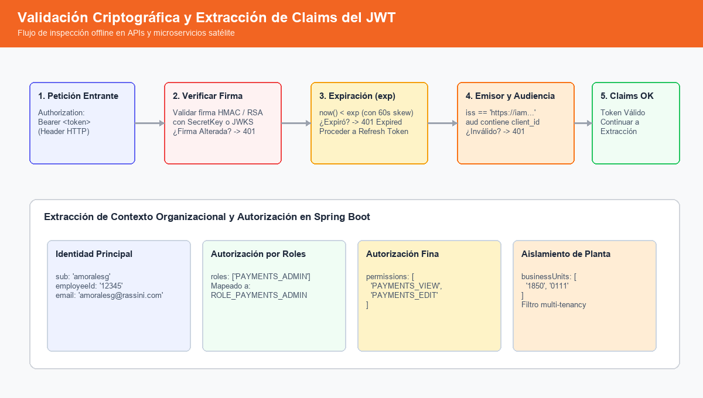

# Referencia de Claims del JWT Corporativo — Rassini IAM
`docs/JWT-Claims-Reference.md`

Este documento define el estándar oficial para la estructura, formato y semántica de los tokens **JSON Web Token (JWT)** emitidos por el IAM central de Rassini para todas las aplicaciones y microservicios del ecosistema.

---

## 1. Ejemplo Completo del Payload Estándar

```json
{
  "iss": "https://iam.rassini.com",
  "sub": "amoralesg",
  "aud": "portal-proveedores",
  "jti": "d4e7a8f1-39c2-498b-9d41-2a6c8e31b7f3",
  "iat": 1757509200,
  "nbf": 1757509200,
  "exp": 1757512800,
  "employeeId": "12345",
  "username": "amoralesg",
  "email": "amoralesg@rassini.com",
  "name": "Agustin Morales",
  "businessUnits": [
    "1850",
    "0111"
  ],
  "roles": [
    "PAYMENTS_ADMIN",
    "EMPLOYEE_USER"
  ],
  "permissions": [
    "PAYMENTS_VIEW",
    "PAYMENTS_EDIT",
    "PAYMENTS_APPROVE",
    "SUPPLIER_PORTAL_ACCESS"
  ],
  "mfa_verified": true
}
```

---

## 2. Diccionario Detallado de Claims

| Claim | Tipo de Dato | Obligatoriedad | RFC / Estándar | Descripción | Valor de Ejemplo |
|---|:---:|:---:|:---:|---|---|
| `iss` | `String (URI)` | **Obligatorio** | RFC 7519 (Registered) | Emisor del token (*Issuer*). Debe corresponder a la URL base del IAM central. | `"https://iam.rassini.com"` |
| `sub` | `String` | **Obligatorio** | RFC 7519 (Registered) | Sujeto del token (*Subject*). Identificador principal del usuario autenticado (coincide con `username`). | `"amoralesg"` |
| `aud` | `String` o `Array[String]` | **Obligatorio** | RFC 7519 (Registered) | Audiencia o cliente destinatario para el que fue emitido el token (*Audience*). | `"portal-proveedores"` |
| `jti` | `String (UUIDv4)` | **Obligatorio** | RFC 7519 (Registered) | Identificador único del token (*JWT ID*). Utilizado para prevenir ataques de repetición (*replay attacks*) y auditoría. | `"d4e7a8f1-39c2-498b-9d41-2a6c8e31b7f3"` |
| `iat` | `NumericDate` (segundos epoch) | **Obligatorio** | RFC 7519 (Registered) | Momento en el que el token fue emitido (*Issued At*). | `1757509200` |
| `nbf` | `NumericDate` (segundos epoch) | **Obligatorio** | RFC 7519 (Registered) | Momento antes del cual el token NO es válido (*Not Before*). Generalmente igual a `iat`. | `1757509200` |
| `exp` | `NumericDate` (segundos epoch) | **Obligatorio** | RFC 7519 (Registered) | Momento en que expira el token (*Expiration Time*). Vida máxima recomendada: **60 minutos**. | `1757512800` |
| `employeeId` | `String` | **Obligatorio** | Rassini Custom | Número de nómina o identificador de empleado en sistemas de RH / ERP. | `"12345"` |
| `username` | `String` | **Obligatorio** | Rassini Custom | Nombre de usuario en el catálogo IAM (redundante con `sub` para compatibilidad con librerías legadas). | `"amoralesg"` |
| `email` | `String (Email)` | **Obligatorio** | OpenID Connect Standard | Dirección de correo institucional verificada del colaborador. | `"amoralesg@rassini.com"` |
| `name` | `String` | Recomendado | OpenID Connect Standard | Nombre y apellidos del usuario. | `"Agustin Morales"` |
| `businessUnits` | `Array[String]` | **Obligatorio** | Rassini Custom | Lista de códigos de unidades de negocio o plantas a las que el usuario tiene acceso operativo. | `["1850", "0111"]` |
| `roles` | `Array[String]` | **Obligatorio** | Rassini Custom | Códigos de roles asignados en el IAM (sin prefijo `ROLE_`). | `["PAYMENTS_ADMIN"]` |
| `permissions` | `Array[String]` | **Obligatorio** | Rassini Custom | Lista plana de códigos de permisos atómicos consolidados de todos sus roles. | `["PAYMENTS_VIEW", "PAYMENTS_EDIT"]` |
| `mfa_verified` | `Boolean` | Recomendado | Rassini Custom | `true` si el usuario completó autenticación multifactor (TOTP/MFA) en su sesión. | `true` |

---

## 3. Reglas de Validación de Tokens en Aplicaciones Consumidoras



Cualquier aplicación satélite debe realizar las siguientes validaciones criptográficas antes de autorizar una solicitud HTTP:

1. **Validación de Firma**:
   - **Fase 1 (Actual)**: Verificar la firma simétrica **HMAC-SHA256** utilizando la clave secreta compartida (`app.security.jwt.secret`) inyectada en el microservicio vía variables de entorno.
   - **Fase 2 (Objetivo)**: Verificar la firma asimétrica **RSA-SHA256** mediante el juego de llaves públicas obtenido dinámicamente desde el endpoint de JWKS (`GET /oauth2/jwks`).
2. **Validación de Expiración (`exp`)**:
   - Si `now() >= exp`, rechazar inmediatamente con `401 Unauthorized`.
   - Se admite un reloj de tolerancia (*clock skew*) no mayor a 60 segundos.
3. **Validación de Emisor (`iss`)**:
   - Debe coincidir estrictamente con el emisor corporativo configurado en `application.yml` (`https://iam.rassini.com`).
4. **Validación de Audiencia (`aud`)**:
   - Debe contener el identificador de la aplicación (`client_id`). Si el token fue emitido para otro sistema y no incluye la audiencia receptora, se debe rechazar.
5. **Aislamiento de Unidades de Negocio**:
   - Cuando un usuario realice una consulta filtrada por planta, la aplicación debe validar que el código de la unidad solicitada esté presente en el array `businessUnits`.

---

## 4. Comparativa: Offline Claims en JWT vs Consulta Online a `/auth/me`

| Necesidad | Enfoque Recomendado | Justificación |
|---|:---:|---|
| Validar permisos en un controlador REST | **JWT Claims** | Permite alta concurrencia, desacoplamiento y cero llamadas de red al IAM. |
| Construir el menú de navegación dinámico | **`GET /auth/me`** | Los menús pueden cambiar en tiempo real en la base de datos sin necesidad de re-emitir el JWT. |
| Conocer si el usuario sigue habilitado tras un despido | **`GET /auth/me` o Revocación** | Consulta la base de datos en tiempo real; el JWT tiene una ventana de validez de hasta 60 min. |
| Filtrar transacciones por Planta (`businessUnit`) | **JWT Claims** | El claim `businessUnits` viaja validado criptográficamente en el contexto del token. |

---

## 5. Prácticas de Seguridad Estrictas

1. **PROHIBIDO EL TRANSPORTE POR URL**: Ningún claim ni el token mismo debe viajar como parámetro en cadenas de consulta (*query string*).
2. **ALMACENAMIENTO EN CLIENTE**:
   - En aplicaciones SPA / Angular, almacenar en memoria o en cookies `HttpOnly` `Secure` `SameSite=Strict`.
   - Evitar almacenar tokens en `localStorage` si la aplicación maneja transacciones de alto riesgo.
3. **LONGITUD DE SECRETOS**:
   - La clave HMAC utilizada para la firma debe tener una entropía mínima de 256 bits (32 caracteres alfanuméricos de alta seguridad).

---

## 6. Placeholders Contextuales Soportados para Menús Externos

Para integraciones ligeras donde una aplicación satélite recibe al usuario desde el menú lateral del IAM, se pueden configurar variables de contexto no sensibles en la URL:

| Placeholder | Valor Resuelto en Runtime | Propósito / Uso Típico |
|---|---|---|
| `${USERNAME}` | `user.getUsername()` | Identificador de usuario (ej. `amoralesg`) |
| `${EMAIL}` | `user.getEmail()` | Correo del colaborador |
| `${EMPLOYEE_ID}` | `user.getId().toString()` | Nómina / identificador numérico |
| `${BUSINESS_UNIT}` | Primera BU del usuario (`1850`) | **Una sola sede**. Mantiene compatibilidad hacia atrás con endpoints que no admiten listas. |
| `${BUSINESS_UNITS}` | Todas las BUs del usuario ordenadas (`0111,1850`) | **Todas las sedes**. Permite recibir la lista multisede separada por comas (codificada en URL como `0111%2C1850`). |
| `${LANGUAGE}` | `"es"` | Idioma de la interfaz |
| `${THEME}` | `"light"` | Tema visual |

> **Regla de Arquitectura**: Microservicios corporativos como `ms-pagos` deben obtener las unidades de negocio autorizadas mediante el claim criptográfico `businessUnits: ["1850", "0111"]` dentro del JWT o mediante `GET /api/v1/auth/me`. Los placeholders en URL como `${BUSINESS_UNITS}` son exclusivamente un facilitador para herramientas externas, SaaS o enlaces web de conveniencia.
