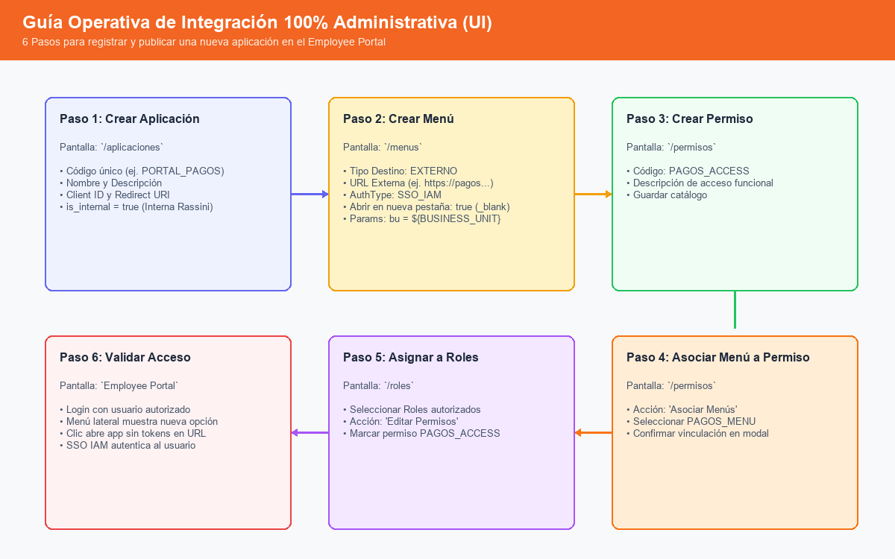
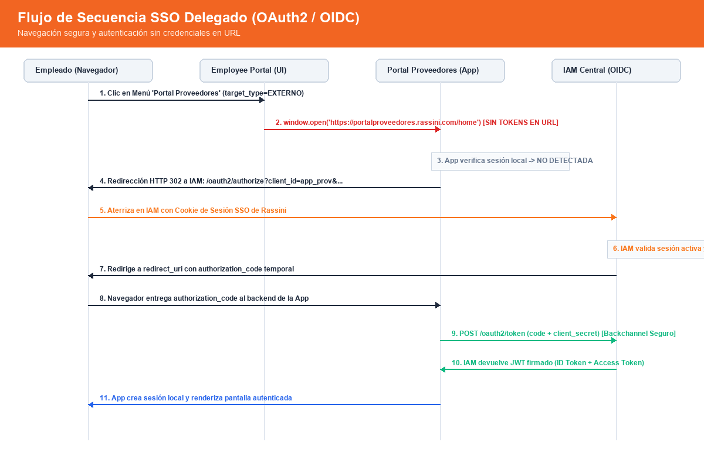

# Guía de Integración de Nuevas Aplicaciones al Ecosistema IAM Rassini
`docs/New-Application-Integration-Guide.md`

Esta guía oficial describe el procedimiento estándar para que cualquier equipo de desarrollo o proveedor integre una nueva aplicación al ecosistema corporativo de **Employee Portal + IAM Rassini**.

> **Principio de Operación**: Toda la integración se administra de forma gráfica y autónoma mediante los módulos administrativos existentes en el portal (**Aplicaciones**, **Menús**, **Permisos** y **Roles**). No se requiere manipular archivos de configuración ni realizar inserciones manuales en base de datos. Los scripts SQL se reservan únicamente como referencia técnica de bajo nivel o contingencia para DBAs.

---

## 1. Flujo Integral de Integración (Vía Módulos Administrativos)



El proceso se compone de 6 pasos secuenciales a través de la interfaz web:

---

## 2. Paso a Paso Detallado desde Pantallas Administrativas

### Paso 1: Crear la Aplicación desde la Pantalla Administrativa (`/aplicaciones`)
1. Iniciar sesión en el portal con un usuario que posea permisos de administración de aplicaciones (`APPLICATION_CREATE`).
2. Ingresar al menú **Operación > Aplicaciones**.
3. Hacer clic en **"Nueva Aplicación"**.
4. Capturar los campos requeridos:
   - **Código**: Identificador único en mayúsculas (ej. `PORTAL_PROVEEDORES`, `PORTAL_PAGOS`).
   - **Nombre**: Nombre oficial visible (ej. `Portal de Proveedores`).
   - **Descripción**: Resumen funcional del sistema.
   - **Aplicación Interna**: Marcar `true` si es un sistema propio de Rassini, o `false` si es un servicio de terceros o SaaS.
   - **Client ID**: Identificador único para el handshake OAuth2 / OIDC (ej. `portal_proveedores_client`).
   - **Redirect URI**: URL de retorno seguro post-autenticación (ej. `https://portalproveedores.rassini.com/login/oauth2/code/iam`).
   - **Activa**: `true`.
5. Hacer clic en **"Guardar"**.

---

### Paso 2: Crear el Menú desde la Pantalla Administrativa (`/menus`)
1. Ingresar a **Operación > Menús**.
2. Hacer clic en **"Nuevo Menú"**.
3. Completar la configuración del enlace:
   - **Código**: Identificador único del menú (ej. `MENU_PORTAL_PROV`).
   - **Etiqueta**: Nombre que aparecerá en el menú lateral (ej. `Portal de Proveedores`).
   - **Aplicación Perteneciente**: Seleccionar la aplicación creada en el Paso 1.
   - **Menú Padre**: Seleccionar si debe anidarse en un grupo existente o dejar en `Ninguno (Raíz)`.
   - **Ícono**: Seleccionar el ícono representativo (ej. `pi pi-external-link`).
   - **Orden**: Número de orden en la barra de navegación.
4. **Configuración de Destino**:
   - Cambiar **Tipo de Destino** a **`Externo (URL Externa)`**.
   - **URL Externa**: Ingresar la URL base de aterrizaje (ej. `https://portalproveedores.rassini.com/home`).
   - **Tipo de Aplicación**: Seleccionar según corresponda (`INTERNA`, `TERCERO` o `SAAS`).
   - **Estrategia de Autenticación**:
     - `SSO_IAM`: Para aplicaciones internas que delegan autenticación al IAM central.
     - `OIDC`: Para sistemas estándar OpenID Connect.
     - `CREDENCIALES_PROPIAS`: Para aplicaciones que gestionan su propio formulario independiente.
     - `NONE`: Para enlaces informativos o públicos.
   - **Abrir en nueva pestaña**: Marcar si la aplicación debe abrirse en `_blank` para conservar la sesión del Employee Portal.
5. **Parámetros de Contexto (Opcional y No Sensible)**:
   - Si la aplicación destino requiere contexto (ej. planta o idioma), agregar parámetros como:
     - `bu` = `${BUSINESS_UNIT}`
     - `lang` = `${LANGUAGE}`
     - `theme` = `${THEME}`
   - ⚠️ **Regla de Seguridad**: El sistema rechazará con error HTTP 400 cualquier intento de registrar tokens o contraseñas (`${JWT}`, `${TOKEN}`, `${PASSWORD}`).
6. Hacer clic en **"Guardar"**.

---

### Paso 3: Crear el Permiso de Acceso (`/permisos`)
1. Ingresar a **Operación > Permisos**.
2. Hacer clic en **"Nuevo Permiso"**.
3. Capturar:
   - **Código**: Código representativo del acceso (ej. `SUPPLIER_PORTAL_ACCESS` o `MENU_PROV_VIEW`).
   - **Descripción**: Permite visualizar y navegar al Portal de Proveedores desde el Employee Portal.
4. Guardar el permiso.

---

### Paso 4: Asociar el Menú al Permiso
1. En la tabla de **Permisos**, ubicar el permiso creado en el Paso 3.
2. Hacer clic en la acción de **"Asociar Menús"** (ícono de lista/enlaces).
3. Seleccionar el menú creado en el Paso 2 (`MENU_PORTAL_PROV`).
4. Confirmar la asociación.

---

### Paso 5: Asignar el Permiso a los Roles Autorizados (`/roles`)
1. Ingresar a **Operación > Roles**.
2. Seleccionar el o los roles que deban tener acceso a la aplicación (ej. `ROLE_COMPRAS`, `ROLE_PROVEEDOR_ADMIN`, `ROLE_ADMIN`).
3. Hacer clic en **"Editar Permisos"**.
4. Marcar el permiso creado en el Paso 3 (`SUPPLIER_PORTAL_ACCESS`).
5. Guardar los cambios del rol.

---

### Paso 6: Validación de Navegación y Acceso
1. Iniciar sesión con un usuario que tenga asignado uno de los roles autorizados.
2. Verificar que el menú lateral del Employee Portal renderice dinámicamente la nueva opción.
3. Hacer clic en el menú:
   - El sistema abrirá la aplicación en la pestaña configurada (`_blank` o `_self`).
   - La URL estará limpia de tokens o credenciales.
   - Si se configuraron variables como `${BUSINESS_UNIT}`, viajarán resueltas de forma transparente (ej. `?bu=1850`).
4. Si la aplicación está configurada como `SSO_IAM`, la aplicación destino detectará la ausencia de sesión local y completará el handshake OIDC de forma transparente contra el IAM.

---

## 3. Casos Soportados y Matriz de Configuración

| Caso de Uso | Tipo de Aplicación | Estrategia de Autenticación | Destino en UI | Parámetros Permitidos |
|---|:---:|:---:|:---:|---|
| **Caso A: Aplicación Interna Rassini** (ej. Portal Proveedores, Pagos, RH) | `INTERNA` | `SSO_IAM` o `OIDC` | `EXTERNO` (`_blank`) | Variables de contexto: `${BUSINESS_UNIT}`, `${BUSINESS_UNITS}`, `${LANGUAGE}`, `${THEME}`. |
| **Caso B: Aplicación SaaS Externa** (ej. Plataforma de capacitación cloud, ServiceNow) | `SAAS` o `TERCERO` | `OIDC` | `EXTERNO` (`_blank`) | Variables no sensibles: `${BUSINESS_UNIT}`, `${BUSINESS_UNITS}`, `${LANGUAGE}`. |
| **Caso C: Aplicación con Autenticación Propia** (ej. Portal legado) | `TERCERO` | `CREDENCIALES_PROPIAS` | `EXTERNO` (`_blank`) | Variables de referencia: `${USERNAME}`, `${EMAIL}`, `${EMPLOYEE_ID}`. |

### 3.1. Tabla Definitiva de Placeholders Soportados

| Placeholder | Descripción | Comportamiento en Runtime | Ejemplo de Resultado |
|---|---|---|---|
| `${USERNAME}` | Identificador del usuario | `user.getUsername()` | `amoralesg` |
| `${EMAIL}` | Correo institucional | `user.getEmail()` | `amoralesg@rassini.com` |
| `${EMPLOYEE_ID}` | ID / Nómina de colaborador | `user.getId().toString()` | `12345` |
| `${BUSINESS_UNIT}` | **Una sola Unidad de Negocio** | Retorna la primera BU del usuario (`iterator().next()`). Útil para sistemas legados que solo admiten un parámetro escalar. | `1850` |
| `${BUSINESS_UNITS}` | **Todas las Unidades de Negocio** | Retorna todas las BUs asignadas ordenadas y unidas por coma (`,`). Ideal para SaaS o externos que admiten multisede. | `0111,1850` |
| `${LANGUAGE}` | Idioma de navegación | Valor fijo `"es"` | `es` |
| `${THEME}` | Tema visual | Valor fijo `"light"` | `light` |

> **Diferencia entre `${BUSINESS_UNIT}` y `${BUSINESS_UNITS}`**:
> - Use `${BUSINESS_UNIT}` cuando el sistema receptor espere un valor único (ej. `?bu=1850`).
> - Use `${BUSINESS_UNITS}` cuando el sistema receptor admita múltiples sedes en un solo parámetro (ej. `?bu=0111,1850`). En la URL final los caracteres especiales se codifican en formato URL estándar (`0111%2C1850`).

---

## 4. Flujo de Navegación y SSO Delegado



---

## 5. Implementación de Referencia: Backend Spring Boot (Fase 1 — HMAC-SHA256)

Para que una aplicación satélite o microservicio corporativo (ej. `ms-pagos`) valide los tokens emitidos por el IAM Central en **Fase 1**, se implementa un filtro de seguridad basado en la clave secreta compartida (`app.security.jwt.secret`). *(En la Fase 2, esta validación migrará a Spring Security OAuth2 Resource Server con JWKS asimétrico sin requerir secretos locales).*

### 5.1. `SecurityConfig.java`
```java
package com.rassini.example.config;

import com.rassini.example.security.JwtAuthenticationFilter;
import lombok.RequiredArgsConstructor;
import org.springframework.context.annotation.Bean;
import org.springframework.context.annotation.Configuration;
import org.springframework.security.config.annotation.method.configuration.EnableMethodSecurity;
import org.springframework.security.config.annotation.web.builders.HttpSecurity;
import org.springframework.security.config.http.SessionCreationPolicy;
import org.springframework.security.web.SecurityFilterChain;
import org.springframework.security.web.authentication.UsernamePasswordAuthenticationFilter;

@Configuration
@EnableMethodSecurity(prePostEnabled = true)
@RequiredArgsConstructor
public class SecurityConfig {

    private final JwtAuthenticationFilter jwtAuthenticationFilter;

    @Bean
    public SecurityFilterChain securityFilterChain(HttpSecurity http) throws Exception {
        http
            .csrf(csrf -> csrf.disable())
            .sessionManagement(session -> session.sessionCreationPolicy(SessionCreationPolicy.STATELESS))
            .authorizeHttpRequests(auth -> auth
                .requestMatchers("/actuator/health", "/v3/api-docs/**", "/swagger-ui/**").permitAll()
                .anyRequest().authenticated()
            )
            .addFilterBefore(jwtAuthenticationFilter, UsernamePasswordAuthenticationFilter.class);

        return http.build();
    }
}
```

### 5.2. `JwtAuthenticationFilter.java`
```java
package com.rassini.example.security;

import io.jsonwebtoken.Claims;
import io.jsonwebtoken.Jwts;
import io.jsonwebtoken.security.Keys;
import jakarta.servlet.FilterChain;
import jakarta.servlet.ServletException;
import jakarta.servlet.http.HttpServletRequest;
import jakarta.servlet.http.HttpServletResponse;
import org.springframework.beans.factory.annotation.Value;
import org.springframework.security.authentication.UsernamePasswordAuthenticationToken;
import org.springframework.security.core.authority.SimpleGrantedAuthority;
import org.springframework.security.core.context.SecurityContextHolder;
import org.springframework.stereotype.Component;
import org.springframework.web.filter.OncePerRequestFilter;

import javax.crypto.SecretKey;
import java.io.IOException;
import java.nio.charset.StandardCharsets;
import java.util.ArrayList;
import java.util.List;

@Component
public class JwtAuthenticationFilter extends OncePerRequestFilter {

    private final SecretKey signingKey;

    public JwtAuthenticationFilter(@Value("${app.security.jwt.secret}") String secret) {
        this.signingKey = Keys.hmacShaKeyFor(secret.getBytes(StandardCharsets.UTF_8));
    }

    @Override
    protected void doFilterInternal(HttpServletRequest request, HttpServletResponse response, FilterChain filterChain)
            throws ServletException, IOException {

        String authHeader = request.getHeader("Authorization");
        if (authHeader == null || !authHeader.startsWith("Bearer ")) {
            filterChain.doFilter(request, response);
            return;
        }

        String token = authHeader.substring(7);
        try {
            Claims claims = Jwts.parser()
                    .verifyWith(signingKey)
                    .build()
                    .parseSignedClaims(token)
                    .getPayload();

            String username = claims.getSubject();
            String employeeId = claims.get("employeeId", String.class);
            String email = claims.get("email", String.class);
            List<String> roles = claims.get("roles", List.class);
            List<String> permissions = claims.get("permissions", List.class);
            List<String> businessUnits = claims.get("businessUnits", List.class);

            List<SimpleGrantedAuthority> authorities = new ArrayList<>();
            if (roles != null) {
                roles.forEach(r -> authorities.add(new SimpleGrantedAuthority("ROLE_" + r)));
            }
            if (permissions != null) {
                permissions.forEach(p -> authorities.add(new SimpleGrantedAuthority(p)));
            }

            RassiniUserPrincipal principal = new RassiniUserPrincipal(
                    username, employeeId, email, roles, permissions, businessUnits
            );

            UsernamePasswordAuthenticationToken authToken =
                    new UsernamePasswordAuthenticationToken(principal, null, authorities);

            SecurityContextHolder.getContext().setAuthentication(authToken);

        } catch (Exception e) {
            SecurityContextHolder.clearContext();
            response.sendError(HttpServletResponse.SC_UNAUTHORIZED, "Token corporativo inválido o expirado");
            return;
        }

        filterChain.doFilter(request, response);
    }
}
```

### 5.3. `CurrentUserService.java`
```java
package com.rassini.example.security;

import org.springframework.security.core.Authentication;
import org.springframework.security.core.context.SecurityContextHolder;
import org.springframework.stereotype.Service;

import java.util.List;

@Service
public class CurrentUserService {

    public RassiniUserPrincipal getCurrentUser() {
        Authentication auth = SecurityContextHolder.getContext().getAuthentication();
        if (auth != null && auth.getPrincipal() instanceof RassiniUserPrincipal principal) {
            return principal;
        }
        throw new IllegalStateException("No hay un usuario corporativo autenticado en el contexto de seguridad.");
    }

    public String getUsername() { return getCurrentUser().username(); }
    public String getEmployeeId() { return getCurrentUser().employeeId(); }
    public String getEmail() { return getCurrentUser().email(); }
    public List<String> getRoles() { return getCurrentUser().roles(); }
    public List<String> getPermissions() { return getCurrentUser().permissions(); }
    public List<String> getBusinessUnits() { return getCurrentUser().businessUnits(); }
}
```

### 5.4. `RassiniUserPrincipal.java` (Record auxiliar)
```java
package com.rassini.example.security;

import java.util.List;

public record RassiniUserPrincipal(
    String username,
    String employeeId,
    String email,
    List<String> roles,
    List<String> permissions,
    List<String> businessUnits
) {}
```

---

## 6. Implementación de Referencia: Frontend Angular

Servicio Angular para consumir el endpoint corporativo `/auth/me` y exponer señales/observables reactivos del usuario autenticado.

### 6.1. `auth.service.ts`
```typescript
import { Injectable, inject, signal } from '@angular/core';
import { HttpClient } from '@angular/common/http';
import { Observable, tap } from 'rxjs';

export interface UserMeResponse {
  username: string;
  employeeId: string;
  email: string;
  roles: string[];
  permissions: string[];
  businessUnits: Array<{ id: number; code: string; name: string }>;
  menus?: any[];
}

@Injectable({
  providedIn: 'root'
})
export class AuthService {
  private readonly http = inject(HttpClient);
  private readonly iamMeUrl = 'https://iam.rassini.com/employee-portal/api/v1/auth/me';

  // Signals reactivos para componentes modernos de Angular
  currentUser = signal<UserMeResponse | null>(null);

  fetchCurrentUser(): Observable<UserMeResponse> {
    return this.http.get<UserMeResponse>(this.iamMeUrl).pipe(
      tap((userData) => this.currentUser.set(userData))
    );
  }

  getCurrentUser(): UserMeResponse | null {
    return this.currentUser();
  }

  hasRole(role: string): boolean {
    return this.currentUser()?.roles.includes(role) ?? false;
  }

  hasPermission(permission: string): boolean {
    return this.currentUser()?.permissions.includes(permission) ?? false;
  }

  getBusinessUnits(): Array<{ id: number; code: string; name: string }> {
    return this.currentUser()?.businessUnits ?? [];
  }
}
```

---

## 7. Anexo Técnico: Referencia SQL y Contingencia DBA

> **IMPORTANTE**: Este apartado es de uso exclusivo para DBAs en escenarios de recuperación de desastres, pipelines de inicialización en ambientes nuevos (CI/CD) o auditoría de base de datos. En el día a día operativo, **debe utilizarse el flujo administrativo de la Sección 2**.

```sql
-- Contingencia / Automatización CI-CD
USE iam;

-- 1. Alta de aplicación
INSERT INTO applications (code, name, description, client_id, client_secret, redirect_uri, is_internal, active)
VALUES ('PORTAL_PROVEEDORES', 'Portal de Proveedores', 'Gestión de facturas y órdenes Rassini', 'portal_proveedores_client', '$2a$10$e8w.jKL91mFqH...', 'https://portalproveedores.rassini.com/login/oauth2/code/iam', 1, 1);

SET @app_id = LAST_INSERT_ID();

-- 2. Alta de menú externo
INSERT INTO menus (code, label, target_type, external_url, open_in_new_tab, app_type, auth_type, application_id, order_index)
VALUES ('MENU_PORTAL_PROV', 'Portal de Proveedores', 'EXTERNO', 'https://portalproveedores.rassini.com/home', 1, 'INTERNA', 'SSO_IAM', @app_id, 10);

SET @menu_id = LAST_INSERT_ID();

-- 3. Parámetro de contexto (no sensible)
INSERT INTO menu_parameters (menu_id, param_name, param_value, active)
VALUES (@menu_id, 'bu', '${BUSINESS_UNIT}', 1);

-- 4. Alta de permiso y asociación
INSERT INTO permissions (code, description)
VALUES ('SUPPLIER_PORTAL_ACCESS', 'Acceso al Portal de Proveedores');

SET @perm_id = LAST_INSERT_ID();

INSERT INTO permission_menu (permission_id, menu_id)
VALUES (@perm_id, @menu_id);
```
