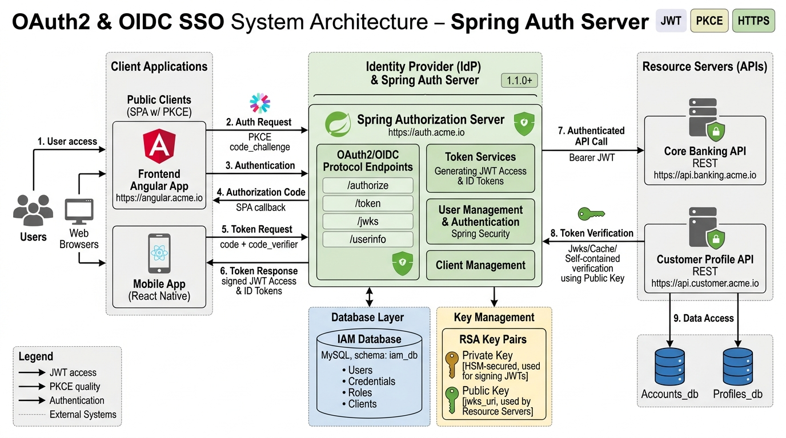
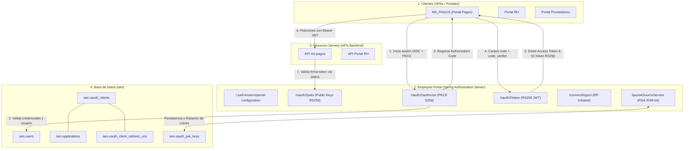

# Arquitectura de SSO Corporativo (OAuth2 / OIDC) — Employee Portal

## 1. Visión General y Objetivos
Este documento describe la arquitectura técnica de Single Sign-On (SSO) corporativo implementada en **Employee Portal** (esquema MySQL `iam`).

El objetivo es consolidar a Employee Portal como el **Identity Provider (IdP)** oficial de Rassini, eliminando la transferencia de contexto sensible por URL y adoptando el estándar de la industria **OAuth 2.1 / OpenID Connect (OIDC)** con **PKCE (Proof Key for Code Exchange)**.



---

## 2. Componentes Clave



---

## 3. Modelo de Datos Relacional (`iam`)

### Tabla `oauth_clients`
Representa los clientes OAuth2/OIDC registrados, vinculados 1:1 a una aplicación del catálogo corporativo (`iam.applications`).
- `id` (BIGINT, PK)
- `client_id` (VARCHAR(100), UNIQUE)
- `client_secret` (VARCHAR(255), NULL para SPAs públicas)
- `client_name` (VARCHAR(150))
- `application_id` (BIGINT, FK -> `applications.id`)
- `client_authentication_methods` (VARCHAR(255), ej: `none` para SPAs, `client_secret_basic` para backends)
- `authorization_grant_types` (VARCHAR(255), ej: `authorization_code,refresh_token`)
- `scopes` (VARCHAR(500), ej: `openid,profile,email,roles,permissions,business_units`)
- `require_proof_key` (TINYINT(1), TRUE para forzar PKCE)
- `require_authorization_consent` (TINYINT(1), FALSE para portales internos de confianza)
- `access_token_time_to_live_seconds` (INT, por defecto 3600)
- `refresh_token_time_to_live_seconds` (INT, por defecto 86400)
- `reuse_refresh_tokens` (TINYINT(1))
- `enabled` (TINYINT(1))

### Tabla `oauth_client_redirect_uris`
URIs normalizadas y tipadas para cada cliente:
- `id` (BIGINT, PK)
- `oauth_client_id` (BIGINT, FK -> `oauth_clients.id`)
- `uri` (VARCHAR(500))
- `uri_type` (ENUM(`REDIRECT`, `POST_LOGOUT`))

### Tabla `oauth_jwk_keys`
Persistencia cifrada de claves RSA 2048-bit para evitar invalidar tokens en reinicios de pods/servidores:
- `id` (BIGINT, PK)
- `key_id` (VARCHAR(100), UNIQUE, ej: `rassini-key-eb39a5f5`)
- `key_type` (VARCHAR(20), ej: `RSA`)
- `algorithm` (VARCHAR(20), ej: `RS256`)
- `use_type` (VARCHAR(20), ej: `sig`)
- `public_key_pem` (TEXT, certificado público X.509 Base64)
- `private_key_encrypted` (TEXT, privada cifrada con AES-GCM-256 usando `MFA_ENCRYPTION_KEY`)
- `status` (ENUM(`ACTIVE`, `ROTATING`, `RETIRED`))

---

## 4. Estructura del JWT Corporativo (RS256)

Los tokens de acceso e ID Tokens firmados con RS256 exponen la identidad del usuario y sus contextos de autorización empresarial:

```json
{
  "iss": "http://localhost:8083/employee-portal",
  "sub": "test_demo",
  "aud": "ms-pagos-client",
  "exp": 1789085000,
  "iat": 1789081400,
  "userId": 15,
  "employeeId": "15",
  "email": "test_demo@rassini.com",
  "roles": [
    "ROLE_DEMO_OPERATOR"
  ],
  "permissions": [
    "PORTAL_DEMO_VIEW",
    "PORTAL_DEMO_ACCESS"
  ],
  "businessUnits": [
    { "id": 1, "code": "0111", "name": "Planta San Martin" },
    { "id": 2, "code": "0301", "name": "Planta Xalostoc" },
    { "id": 3, "code": "09",   "name": "Corporativo" },
    { "id": 4, "code": "1000", "name": "Planta Puebla" },
    { "id": 5, "code": "99",   "name": "Servicios Compartidos" }
  ],
  "hasAllBusinessUnits": false,
  "bu": "0111,0301,09,1000,99"
}
```

---

## 5. Estrategia de Coexistencia y Retiro Gradual (HMAC -> RS256)
1. **Fase Actual (Coexistencia Transparente)**:
   - Endpoint legacy `/api/v1/auth/login` continúa funcionando para no romper la app móvil o clientes que aún no migran.
   - Todo response de login/refresh legacy incluye la cabecera HTTP:
     ```http
     X-Deprecation-Warning: HMAC login is deprecated. Please migrate to corporate SSO via OAuth2/OIDC (/oauth2/authorize).
     ```
2. **Fase de Adopción**:
   - Nuevos desarrollos (como `ms-pagos`) usan exclusivamente OAuth2/OIDC con PKCE.
3. **Fase de Retiro (Sunset)**:
   - Una vez migradas las aplicaciones corporativas, se deshabilitará el endpoint `/api/v1/auth/login` emitiendo únicamente tokens RS256 vía `/oauth2/token`.
