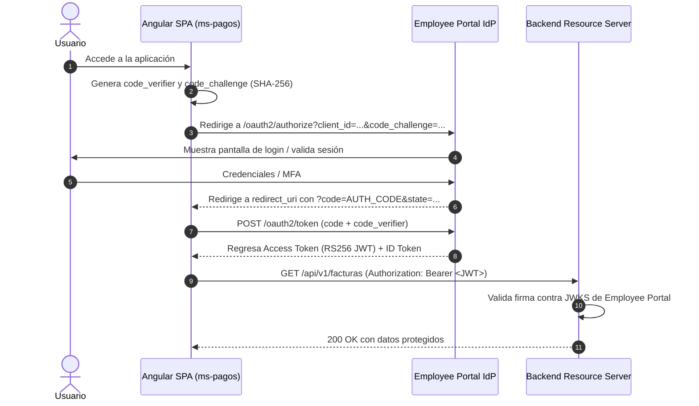

# Guía de Integración OpenID Connect / OAuth2 para Desarrolladores

Esta guía explica paso a paso cómo integrar una aplicación frontend (Angular, React, Vue) o backend a la plataforma de SSO de Rassini.

---

## 1. Endpoints del Identity Provider (IdP)

| Servicio | URL |
| :--- | :--- |
| **OpenID Configuration** | `GET /employee-portal/.well-known/openid-configuration` |
| **JWKS (Llaves Públicas)** | `GET /employee-portal/oauth2/jwks` |
| **Authorize (Login / PKCE)** | `GET /employee-portal/oauth2/authorize` |
| **Token (Canje de Código)** | `POST /employee-portal/oauth2/token` |
| **RP-Initiated Logout** | `GET /employee-portal/connect/logout` |

---

## 2. Flujo de Autenticación SPA con PKCE



---

## 3. Integración Frontend en Angular (`angular-oauth2-oidc`)

### Instalación
```bash
npm install angular-oauth2-oidc --save
```

### Configuración del `AuthConfig`
```typescript
import { AuthConfig } from 'angular-oauth2-oidc';

export const authCodeFlowConfig: AuthConfig = {
  issuer: 'http://localhost:8083/employee-portal',
  redirectUri: window.location.origin + '/callback',
  postLogoutRedirectUri: window.location.origin + '/login',
  clientId: 'ms-pagos-client',
  responseType: 'code',
  scope: 'openid profile email roles permissions business_units',
  showDebugInformation: true,
  requireHttps: false // Solo en desarrollo local
};
```

---

## 4. Validación de Token en Backends (Spring Boot Resource Server)

En el `pom.xml` del microservicio backend (ej: `ms-pagos` backend):
```xml
<dependency>
    <groupId>org.springframework.boot</groupId>
    <artifactId>spring-boot-starter-oauth2-resource-server</artifactId>
</dependency>
```

En `application.yml`:
```yaml
spring:
  security:
    oauth2:
      resourceserver:
        jwt:
          issuer-uri: http://localhost:8083/employee-portal
          jwk-set-uri: http://localhost:8083/employee-portal/oauth2/jwks
```
