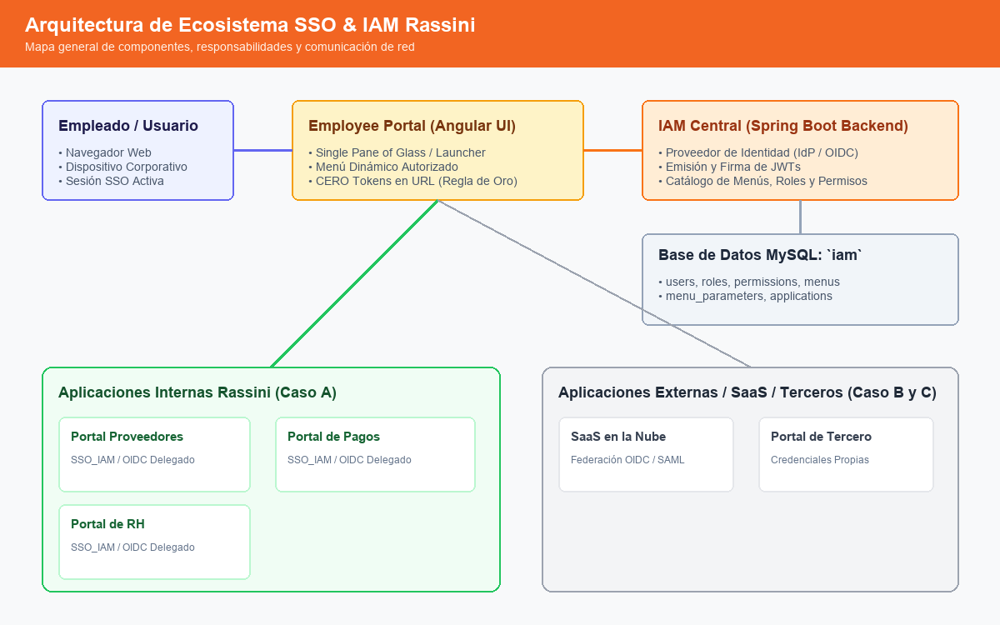
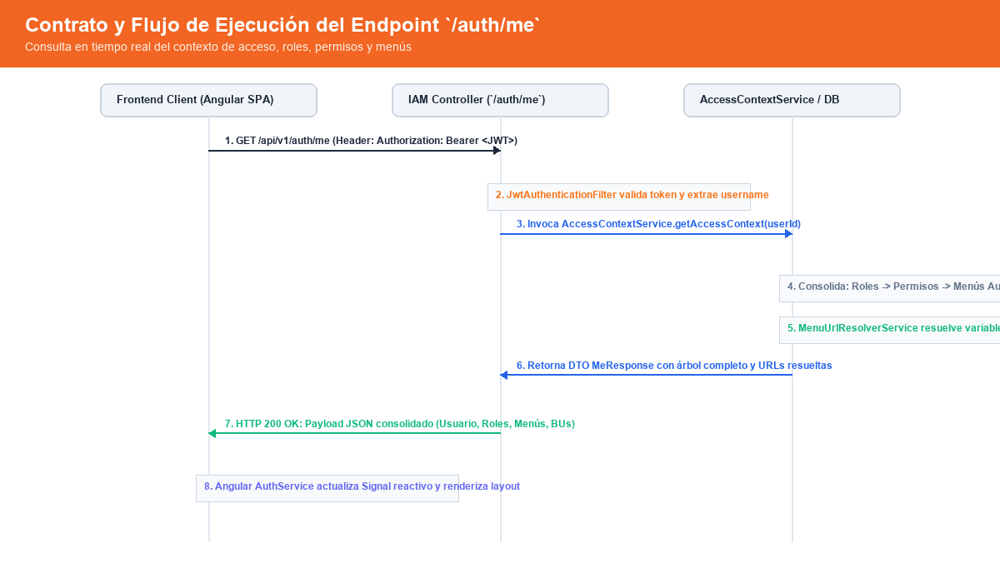
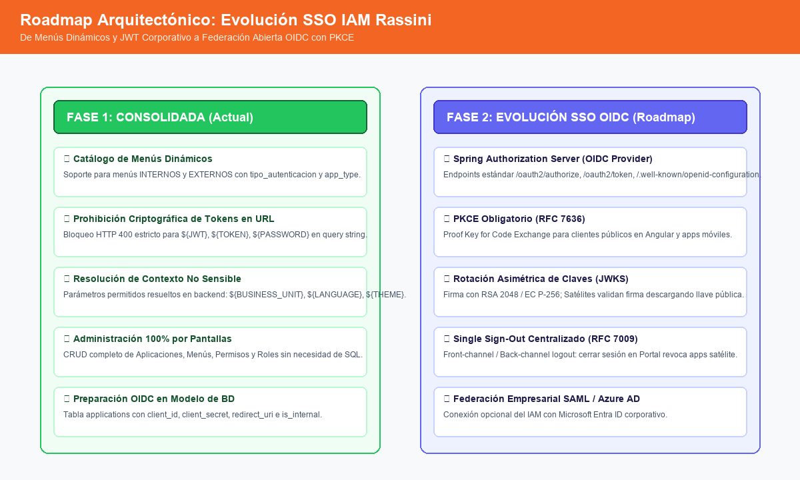

# Arquitectura de SSO Corporativo y Menús Externos — Ecosistema IAM Rassini

Este documento describe la arquitectura corporativa de Single Sign-On (SSO) y la integración de aplicaciones mediante el catálogo dinámico de Menús del IAM.

---

## 1. Arquitectura General

En el ecosistema Rassini, el **IAM Central (Employee Portal Backend)** actúa como la autoridad central de identidad, autenticación, roles, permisos y menús. El **Employee Portal (Frontend Angular)** funciona como el punto de entrada principal (*Single Pane of Glass* o *Enterprise Launcher*) para los colaboradores.

### 1.1. Diagrama de Arquitectura de Ecosistema



### 1.2. Responsabilidades de Cada Componente

| Componente | Responsabilidad Principal | Regla de Oro de Seguridad |
|---|---|---|
| **Employee Portal (UI)** | Lanzador de aplicaciones y punto de acceso unificado. Muestra el menú dinámico autorizado para el usuario. | **NUNCA** transporta tokens JWT, contraseñas ni secretos en parámetros de URL (*query string*). |
| **IAM Central (Backend)** | Proveedor de Identidad y Autorización (IdP / OIDC Provider). Emite tokens JWT firmados, administra usuarios, catálogos de menús y políticas de acceso. | Resuelve únicamente parámetros de contexto no sensibles en las URLs de menús. Valida y firma tokens corporativos. |
| **Aplicación Destino (ej. Proveedores, ms-pagos)** | Aplicación consumidora (*Relying Party* / Resource Server). Responsable de proteger sus propios recursos y verificar la sesión local. | Si no detecta sesión local del usuario, valida el token JWT emitido por el IAM o delega la autenticación. |
| **Aplicaciones de Terceros / SaaS** | Software externo donde Rassini no controla el ciclo de vida de autenticación completo. | Reciben únicamente redirecciones estándar o enlaces con variables de contexto inocuas (ej. `${BUSINESS_UNIT}`, `${LANGUAGE}`). |

### 1.3. Estado Actual (Fase 1) vs Estado Objetivo (Fase 2)

Para evitar confusiones técnicas entre la implementación operativa existente y la evolución corporativa planificada, se define la siguiente matriz de transición:

| Dimensión Arquitectónica | Estado Actual (Fase 1 — Implementada) | Estado Objetivo (Fase 2 — Roadmap) |
|---|---|---|
| **Mecanismo de Firma JWT** | **Simétrica: HMAC-SHA256**<br>Clave secreta compartida vía propiedad `app.security.jwt.secret` (mínimo 256 bits). | **Asimétrica: RSA-256 o EC P-256**<br>Par de llaves pública / privada. La clave privada reside exclusivamente en el IAM Central. |
| **Distribución de Llaves** | **Shared Secret** distribuido de forma segura a través de variables de entorno del servidor. | **JWKS (JSON Web Key Set)** expuesto públicamente por el IAM en `GET /.well-known/jwks.json` con rotación automática. |
| **Arquitectura de Identidad** | **IAM Central REST + JWT Directo**<br>Servicio centralizado emite JWT al autenticar; microservicios satélite (`ms-pagos`) validan firma localmente o consultan `/auth/me`. | **Spring Authorization Server (OIDC / OAuth 2.1)**<br>Endpoints estándar RFC 6749/RFC 8414: `/oauth2/authorize`, `/oauth2/token`, `/oauth2/jwks`, `/.well-known/openid-configuration`. |
| **Flujo de Integración Apps** | **Menús Dinámicos y Lanzador Web**<br>Redirección directa a URLs externas con resolución de parámetros no sensibles en runtime (`${BUSINESS_UNIT}`, `${LANGUAGE}`). Validación de token en Resource Server. | **Federación OAuth2 / OIDC Delegada**<br>Flujo `authorization_code` con **PKCE obligatorio** para SPAs/móviles y redirección transparente entre satélites. |
| **Gestión de Sesiones** | **Sesión Local por Aplicación + TTL de JWT**<br>Cada sistema mantiene su sesión local; revocación sujeta a expiración de token (60 min) o consulta a `/auth/me`. | **Single Sign-Out Centralizado**<br>OIDC Front-Channel / Back-Channel Logout (RFC 7009 / RFC 8693) notificando a todos los satélites al cerrar sesión en el portal. |

---

## 2. Flujo de Autenticación Corporativo (SSO con OIDC / OAuth2)

El siguiente flujo describe cómo un usuario autenticado en el Employee Portal accede a una aplicación satélite (como el Portal de Proveedores) sin tener que volver a ingresar sus credenciales, y **sin transmitir tokens por query string**.


### Paso a Paso Detallado:
1. **Acceso al Portal**: El usuario inicia sesión en el Employee Portal mediante el IAM central.
2. **Consulta de Menús**: El portal carga los menús asignados al usuario según sus roles y permisos.
3. **Clic en Menú Externo**: El usuario hace clic en un menú configurado como `target_type = EXTERNO`.
4. **Llegada a Aplicación Destino**: El navegador abre la URL destino (ej. `https://portalproveedores.rassini.com/home`). La URL **no contiene tokens** ni credenciales.
5. **Detección de Sesión**: La aplicación destino inspecciona sus cookies locales de sesión.
6. **Delegación**: Al no tener sesión local, inicia el flujo estándar OIDC redirigiendo al endpoint del IAM: `/oauth2/authorize`.
7. **SSO Transparente**: El IAM reconoce la sesión activa del usuario (mediante cookie segura de dominio o sesión corporativa).
8. **Devolución de Código**: El IAM redirige de vuelta a la aplicación con un código de autorización temporal de un solo uso (`code`).
9. **Intercambio Seguro**: La aplicación destino intercambia el código por un JWT directamente de servidor a servidor (*backchannel* cifrado).
10. **Acceso Concedido**: El usuario accede de inmediato sin volver a capturar usuario ni contraseña.

---

## 3. Información Disponible en el JWT (Claims Estándar)

El token JWT emitido por el IAM central para aplicaciones corporativas debe contener los siguientes claims estándar de identidad y contexto organizacional:

```json
{
  "iss": "https://iam.rassini.com",
  "sub": "amoralesg",
  "aud": "portal-proveedores",
  "exp": 1757512800,
  "nbf": 1757509200,
  "iat": 1757509200,
  "jti": "b53f880e-4375-4d22-83b5-3bc6e6f98762",
  "employeeId": "12345",
  "email": "amoralesg@rassini.com",
  "name": "Agustin Morales",
  "businessUnits": [
    "1850",
    "0111"
  ],
  "roles": [
    "ADMIN",
    "PAYMENTS_USER"
  ],
  "permissions": [
    "PAYMENTS_VIEW",
    "PAYMENTS_EDIT",
    "SUPPLIER_PORTAL_ACCESS"
  ]
}
```

### Definición de Claims:
- `sub`: Nombre de usuario único del colaborador.
- `employeeId`: Número de nómina o ID de empleado.
- `email`: Correo electrónico institucional.
- `businessUnits`: Códigos de las unidades de negocio autorizadas para el usuario.
- `roles`: Códigos de roles asignados en el esquema IAM.
- `permissions`: Permisos atómicos consolidados del usuario para autorización fina.

---

## 4. Cómo Consume Otra Aplicación el JWT (Guía Técnica)

Las aplicaciones satélite (ej. desarrolladas en Spring Boot, Node.js, .NET) pueden validar y consumir el JWT de forma autónoma.

### 4.1. Validación de Firma y Claims (Ejemplo Java Spring Boot)

En Spring Boot, se configura un `JwtAuthenticationFilter` o Spring Security OAuth2 Resource Server:

```java
@Component
public class RassiniJwtValidator {

    private final SecretKey key; // o PublicKey RSA/EC si se usa JWKS

    public RassiniJwtValidator(@Value("${app.iam.jwt.secret}") String secret) {
        this.key = Keys.hmacShaKeyFor(secret.getBytes(StandardCharsets.UTF_8));
    }

    public Claims validateAndExtractClaims(String token) {
        try {
            return Jwts.parser()
                    .verifyWith(this.key)
                    .build()
                    .parseSignedClaims(token)
                    .getPayload();
        } catch (ExpiredJwtException e) {
            throw new UnauthorizedException("El token corporativo ha expirado. Proceda a refrescar.");
        } catch (JwtException e) {
            throw new UnauthorizedException("Token corporativo inválido o firma adulterada.");
        }
    }
}
```

### 4.2. Extracción de Roles, Permisos y Unidades de Negocio
```java
public UserPrincipal extractUser(Claims claims) {
    String username = claims.getSubject();
    String employeeId = claims.get("employeeId", String.class);
    String email = claims.get("email", String.class);
    List<String> roles = claims.get("roles", List.class);
    List<String> permissions = claims.get("permissions", List.class);
    List<String> businessUnits = claims.get("businessUnits", List.class);

    return new UserPrincipal(username, employeeId, email, roles, permissions, businessUnits);
}
```

### 4.3. Renovación de Token (*Refresh Token*)
Cuando el token expira:
1. La aplicación satélite invoca el endpoint central del IAM: `POST /api/v1/auth/refresh`.
2. Envía el `refreshToken` en el cuerpo:
   ```json
   {
     "refreshToken": "eyJhbGciOi..."
   }
   ```
3. El IAM valida que el usuario siga habilitado y devuelve un nuevo `accessToken`.

---

## 5. Contrato del Endpoint `/auth/me`



El endpoint `/auth/me` permite a las aplicaciones consultar en tiempo real el contexto de acceso actualizado del usuario sin depender únicamente de los claims estáticos del token.

### Contrato HTTP:
- **Método**: `GET`
- **Ruta**: `/api/v1/auth/me`
- **Headers**: `Authorization: Bearer <accessToken>`

### Respuesta Esperada (`200 OK`):
```json
{
  "user": {
    "id": 1,
    "username": "amoralesg",
    "email": "amoralesg@rassini.com",
    "enabled": true,
    "forcePasswordChange": false,
    "mfaEnabled": false,
    "mfaRequired": false
  },
  "roles": [
    "ADMIN",
    "PAYMENTS_USER"
  ],
  "permissions": [
    "MENU_VIEW",
    "PAYMENTS_VIEW",
    "SUPPLIER_PORTAL_ACCESS"
  ],
  "menus": [
    {
      "id": 10,
      "code": "PORTAL_PROV",
      "label": "Portal Proveedores",
      "targetType": "EXTERNO",
      "externalUrl": "https://portalproveedores.rassini.com/home",
      "resolvedUrl": "https://portalproveedores.rassini.com/home?bu=1850",
      "openInNewTab": true,
      "appType": "INTERNA",
      "authType": "SSO_IAM",
      "children": []
    }
  ],
  "businessUnits": [
    {
      "id": 1,
      "code": "1850",
      "name": "Planta San Martín"
    }
  ],
  "hasAllBusinessUnits": false
}
```

### ¿Cuándo usar JWT directamente y cuándo usar `/auth/me`?
| Criterio | Usar JWT (Offline Claims) | Usar `/auth/me` (Consulta Online) |
|---|---|---|
| **Frecuencia** | Cada petición HTTP en APIs y microservicios. | Carga inicial de la aplicación o cambio de contexto. |
| **Rendimiento** | Ultrarrápido (validación criptográfica local, 0 latencia de red). | Requiere llamada HTTP adicional al IAM. |
| **Frescura** | Válido mientras no expire el token (1 hora). | Datos en tiempo real inmediato (si se revocó un permiso o menú). |
| **Uso Típico** | Microservicios que validan permisos para ejecutar una acción. | Frontends que necesitan renderizar el menú dinámico y el perfil. |

---

## 6. Guía para Futuras Aplicaciones

Para integrar una nueva aplicación al ecosistema IAM de Rassini, siga estos 6 pasos:

### Paso 1: Crear la Aplicación desde la Pantalla Administrativa (`/aplicaciones`)
El administrador del IAM registra la aplicación desde la interfaz web:
1. Navegar a **Operación > Aplicaciones**.
2. Hacer clic en **"Nueva Aplicación"**.
3. Capturar:
   - **Código**: `PORTAL_PAGOS`
   - **Nombre**: `Portal de Pagos`
   - **Aplicación Interna**: `true` (para sistemas propios Rassini)
   - **Client ID**: `portal_pagos_client`
   - **Redirect URI**: `https://pagos.rassini.com/login/oauth2/code/iam`
   - **Activa**: `true`

### Paso 2: Crear el Menú desde la Pantalla Administrativa (`/menus`)
Desde la pantalla de administración de Menús (`/menus`), cree el menú:
1. Navegar a **Operación > Menús**.
2. Hacer clic en **"Nuevo Menú"**.
3. Capturar:
   - **Código**: `PAGOS_MENU`
   - **Etiqueta**: `Portal de Pagos`
   - **Aplicación Perteneciente**: Seleccionar `Portal de Pagos`.
   - **Tipo de Destino**: `Externo (URL Externa)`.
   - **URL Externa**: `https://pagos.rassini.com/dashboard`
   - **Tipo de Aplicación**: `INTERNA`
   - **Estrategia de Autenticación**: `SSO_IAM`
   - **Abrir en nueva pestaña**: Marcado (`_blank`)
   - **Parámetros contextuales opcionales**: `bu` = `${BUSINESS_UNIT}`

### Paso 3: Asignar Permiso y Vincular Menú (`/permisos` y `/roles`)
1. Crear el permiso en **Operación > Permisos** (ej. `PAGOS_ACCESS`).
2. En la lista de permisos, hacer clic en **"Asociar Menús"** y seleccionar `PAGOS_MENU`.
3. Navegar a **Operación > Roles**, editar el rol autorizado (ej. `ROLE_FINANZAS`) y marcar el permiso `PAGOS_ACCESS`.

### Paso 4: Integrar Validación del Token en la Aplicación Destino

#### Enfoque Fase 1 (Actual — HMAC-SHA256):
En el archivo `application.yml` de la nueva aplicación satélite (ej. `ms-pagos`):
```yaml
app:
  security:
    jwt:
      secret: ${IAM_JWT_SECRET} # Shared secret simétrico (mismo valor que IAM Central)
```
La aplicación satélite valida el token entrante en los headers HTTP (`Authorization: Bearer <token>`) mediante el `JwtAuthenticationFilter` detallado en la Sección 4.1.

#### Enfoque Fase 2 (Objetivo — OIDC / OAuth2 Spring Authorization Server):
Cuando se habilite Spring Authorization Server en Fase 2, la integración evolucionará a cliente estándar OIDC:
```yaml
spring:
  security:
    oauth2:
      client:
        registration:
          iam:
            client-id: portal_pagos_client
            client-secret: ${IAM_CLIENT_SECRET}
            scope: openid,profile,email
            authorization-grant-type: authorization_code
            redirect-uri: "{baseUrl}/login/oauth2/code/{registrationId}"
        provider:
          iam:
            authorization-uri: https://iam.rassini.com/oauth2/authorize
            token-uri: https://iam.rassini.com/oauth2/token
            jwk-set-uri: https://iam.rassini.com/oauth2/jwks
            user-info-uri: https://iam.rassini.com/employee-portal/api/v1/auth/me
            user-name-attribute: sub
```

### Paso 5: Validar Permisos en la Aplicación Destino
En los controladores de la aplicación satélite:
```java
@PreAuthorize("hasAuthority('PAGOS_VIEW')")
@GetMapping("/api/v1/pagos")
public List<PagoDto> getPagos() { ... }
```

### Paso 6: Consumir Menú Dinámico
La aplicación satélite puede invocar `GET /api/v1/auth/me` con el token de usuario para obtener y renderizar los submódulos autorizados para ese colaborador.

---

## 7. Políticas de Seguridad Obligatorias

1. **PROHIBICIÓN ESTRICTA DE CREDENCIALES EN URL**:
   - Bajo ninguna circunstancia se deben enviar parámetros como `token`, `jwt`, `password`, `secret` o `api_key` en query strings.
   - La API del backend valida y rechaza con `400 Bad Request` cualquier intento de registrar variables como `${JWT}` en `menu_parameters`.
2. **PARÁMETROS PERMITIDOS (TABLA DEFINITIVA DE PLACEHOLDERS)**:
   - Únicamente se permite la resolución de variables contextuales no sensibles:

| Placeholder | Descripción | Comportamiento en Runtime | Ejemplo de Resultado |
|---|---|---|---|
| `${USERNAME}` | Identificador único del usuario | Extrae `user.getUsername()` | `amoralesg` |
| `${EMAIL}` | Correo electrónico corporativo | Extrae `user.getEmail()` | `amoralesg@rassini.com` |
| `${EMPLOYEE_ID}` | Número o ID único del empleado | Extrae `user.getId().toString()` | `12345` |
| `${BUSINESS_UNIT}` | **Una sola Unidad de Negocio** | Extrae el primer elemento del conjunto de BUs asignadas (`user.getBusinessUnits().iterator().next().getCode()`). Ideal para retrocompatibilidad. | `1850` |
| `${BUSINESS_UNITS}` | **Todas las Unidades de Negocio** | Extrae todas las BUs asignadas ordenadas alfabéticamente y unidas por coma (`,`). Permite pasar el contexto multisede a sistemas externos. | `0111,1850` |
| `${LANGUAGE}` | Idioma preferido de la sesión | Valor fijo `"es"` | `es` |
| `${THEME}` | Tema visual configurado | Valor fijo `"light"` | `light` |

> **Diferencia Clave entre `${BUSINESS_UNIT}` y `${BUSINESS_UNITS}`**:
> - `${BUSINESS_UNIT}` retorna estrictamente un valor escalar individual (la primera unidad asignada), garantizando compatibilidad con sistemas que solo aceptan un parámetro `bu` simple.
> - `${BUSINESS_UNITS}` retorna la lista consolidada y ordenada de todas las sedes autorizadas separadas por comas (ej. `0111,1850`), permitiendo a sistemas externos filtrar datos multisede sin requerir consultas adicionales al IAM.

3. **TRANSPORTE SEGURO**:
   - Todas las URLs externas corporativas deben usar estrictamente protocolo `HTTPS`.

---

## 8. Roadmap Técnico SSO — Fase 2



Para la fase 2 de consolidación del ecosistema SSO corporativo, se planifican los siguientes hitos de evolución arquitectónica:

### 8.1. Hito 1: Implementación de Spring Authorization Server (OIDC Provider)
- Incorporar la dependencia oficial `spring-boot-starter-oauth2-authorization-server`.
- Exponer los endpoints estándar RFC 6749 / OpenID Connect Core:
  - `GET /oauth2/authorize` (Pantalla de consentimiento y emisión de `authorization_code`).
  - `POST /oauth2/token` (Intercambio de código por ID Token y Access Token).
  - `GET /oauth2/jwks` (JSON Web Key Set con claves asimétricas RSA/EC rotativas).
  - `GET /.well-known/openid-configuration` (Discovery Document OIDC para autoconfiguración de clientes).

### 8.2. Hito 2: Soporte de PKCE (Proof Key for Code Exchange)
- Habilitar obligatoriamente PKCE (RFC 7636) para aplicaciones de una sola página (SPAs en Angular/React) y aplicaciones móviles, mitigando el robo de códigos de autorización en clientes públicos (*public clients*).

### 8.3. Hito 3: Single Sign-Out y Revocación Centralizada de Sesiones
- Implementación de **OIDC Front-Channel / Back-Channel Logout (RFC 7009)**.
- Cuando un usuario cierre sesión en el Employee Portal, el IAM notificará y revocará las sesiones activas en el Portal de Proveedores, Portal de Pagos y Portal de RH simultáneamente.

### 8.4. Hito 4: Migración Criptográfica a Claves Asimétricas (RSA / EC)
- Reemplazar la clave simétrica compartida HMAC-SHA256 por un par de llaves público/privada (RSA 2048+ o EC P-256).
- Las aplicaciones satélite validarán firmas descargando dinámicamente la llave pública desde el endpoint `/oauth2/jwks` sin necesidad de compartir secretos en sus archivos de configuración `application.yml`.
